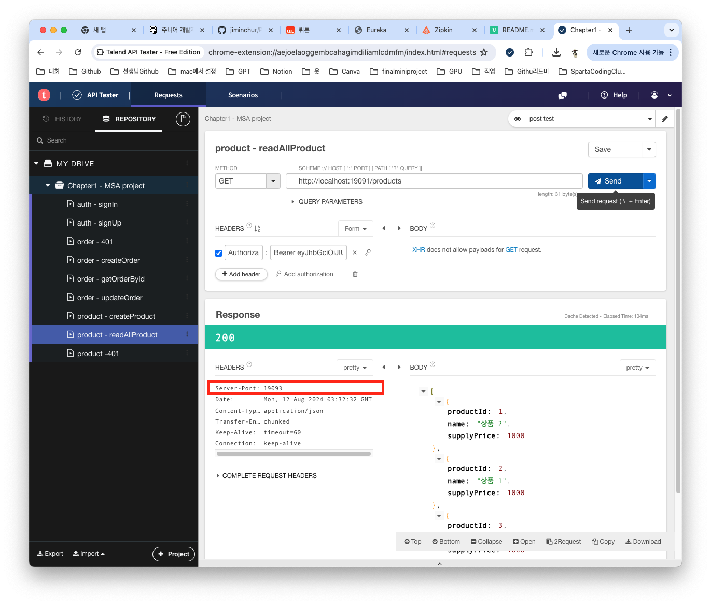

## 🤓 모든 API 의 Response Header 에 Server-Port Key로 현재 실행중인 서버의 포트를 추가하기
MSA로 프로젝트를 진행하게 되면 여러개의 서버의 포트들이 있다. 만약 상품서비스를 로드벨런싱 처리를 한다면 제대로 라운드로빈 방식으로 작동되는지 또는 다른 방식으로 진행이 되는지 로그를 찍어보는 방법도 있고 Response Header에 추가하는 방법도 있다. 오늘은 후자에 대해서 알아 보도록 하자.

## 💡 Custom Headers
[👉🏻 Medium - Crafting Spring Boot REST APIs with Custom Headers 링크](https://gurselgazii.medium.com/crafting-spring-boot-rest-apis-with-custom-headers-27a5c4fdaae6)

위에 링크에 들어가게 되면 Custom Header에 대해서 예제와 응용방법에 대해서 자세하게 나와있다. 구글링을 통해 찾아본 곳들 중에 이곳이 제일 좋았던거 같다.

여러가지 방법을 사용해봤지만 내가 적용했던 방법은 다음과 같다. 내가 적용한 방법은 모든 API마다 적용을 해서 좋은 방법은 아닌거 같다. 

1. @Value 어노테이션으로 서버 포트 가져오기
```
 @Value("${server.port}") // application.yml에서 서버 포트 값을 주입
    private String serverPort;
```
2. 서버 포트 정보를 응답 헤더에 추가하는 메서드 생성하기
```
private void addServerPortHeader(
            HttpServletResponse response // HTTP 응답 객체
    ) {
        response.addHeader(
                "Server-Port", // 헤더 이름
                serverPort); // 서버 포트 값 추가
    }
```
* 최대한 중복을 줄이기 위한 방법이였다.
3. 모든 상품 조회 API에 적용하기
```
@GetMapping
    public List<ProductDto> readAllProduct(
            HttpServletResponse response // HTTP 응답 객체
    ){
        addServerPortHeader(response); // 서버 포트 헤더 추가
        return productService.readAllProduct(); // 모든 상품 조회 서비스 호출
    }
```
4. 확인하기


마지막 이미지로 잘 적용이 된걸 확인 할 수가 있다. 더 좋은 방법을 찾아봐서 적용을 해봐야 할거 같다.