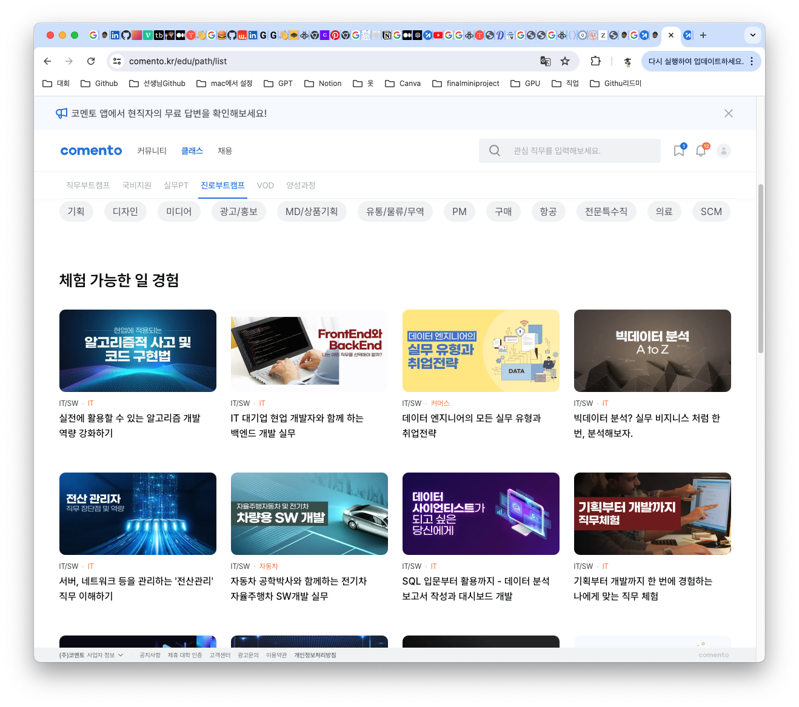
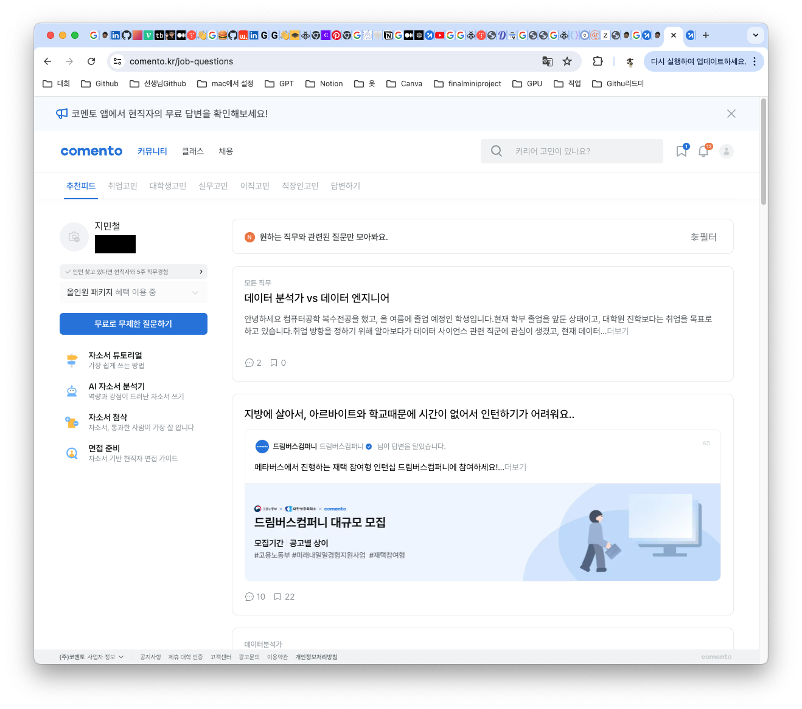
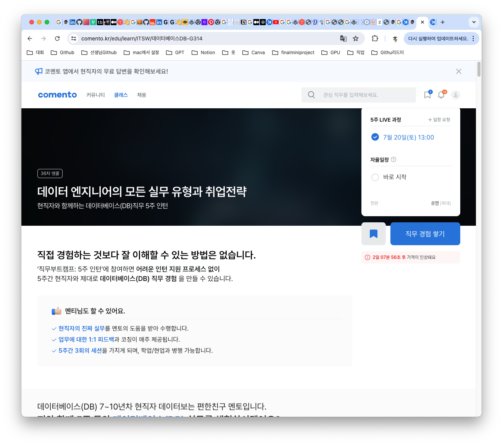

## 🧐 코멘토란 어떤 사이트일까?? 
[👉🏻 코멘토 사이트 링크 👈🏻](https://comento.kr/edu)
코멘토는 커리어의 시작을 준비하는 사람들이나 이제 막 커리어를 시작한 사람들의 커리어 시작과 성장을 도와주는 플랫폼 서비스이다.

코멘토에는 현재 여러개의 직무부트 캠프가 존재한다.

여러가지 직종 여러가지 직업을 인턴이 되어봐서 한달동안 진행할 수 있게 해준다.

취업에 관한 고민이나 직장인에 관한 고민들을 나눌수 있는 커뮤니티 까지 존재하는 걸 알수가있다.

## 🫵 내가 선택한 직무부트캠프는??
나는 데이터 엔지니어를 꿈꾸는 준비생으로써 내가 코멘토를 선택하게 된 이유도 데이터 엔지니어 직무부트캠프가 있었기 때문이다.

아직 실무를 경험해보지 못한 나로써는 실제 업무를 체험해볼수있다는 것 자체가 나에겐 큰 메리트로 다가왔다.

주요하게 경험해보는 내용으로는 DB엔지니어의 정확한 실무 분야, 데이터 엔지니어 공통역량과 커리어 패스, 최신 IT트랜드 경험등이 있다.

글을 읽어보면 데이터 엔지니어쪽에 가깝다라기보다는 DBA나 DA쪽에 가깝다라는 느낌이 크게 들지만 DB에 대해서 실제 업무를 다뤄볼수있는 경험도 나에게는 큰 도움을 받을 것 같았다.

## 💳 결제완료!!
금액은 대략 10만원 중반대였던것같다. 금액은 다른 온라인 강의 하나를 살 수 있을정도의 금액대여서 나쁘지만은 않았다.

나는 6/29날 시작하는 코스로 신청을 하였고 주차가 지날때 마다 회고를 통해 기록을 해야겠다..다음 포스팅 1주차 회고에서 만나요~~