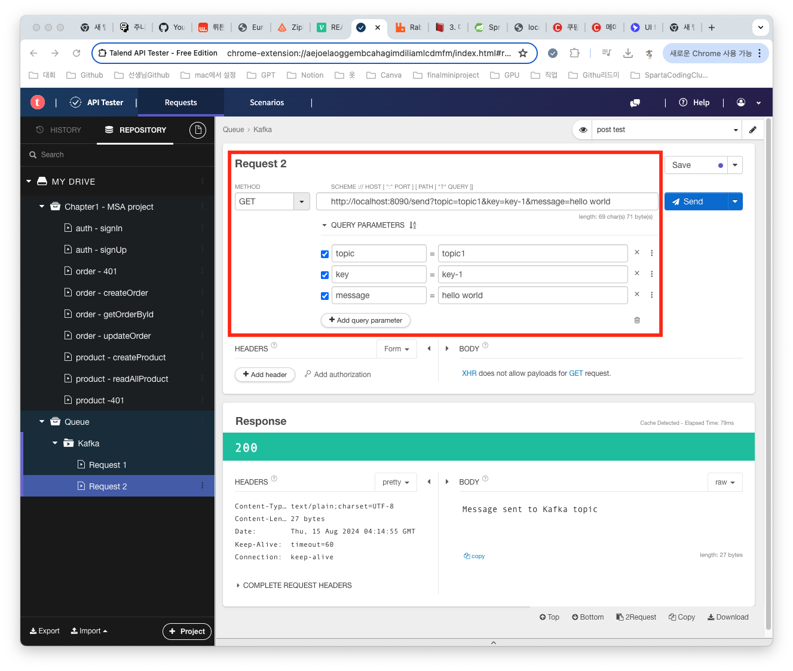
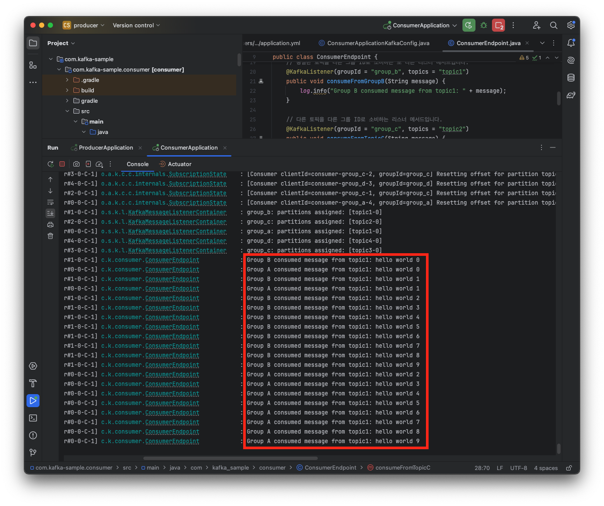
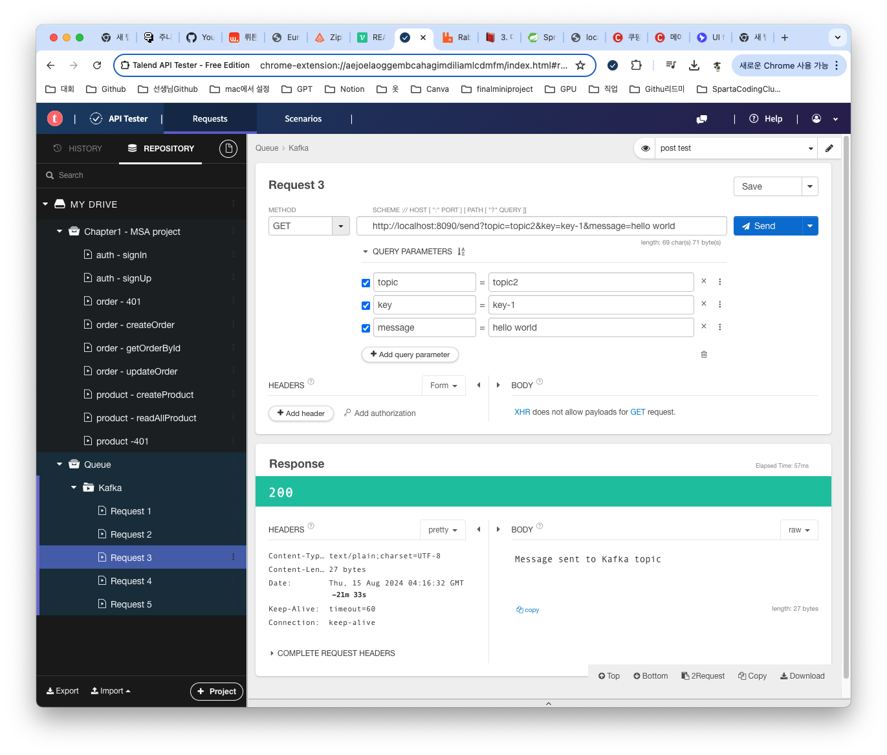
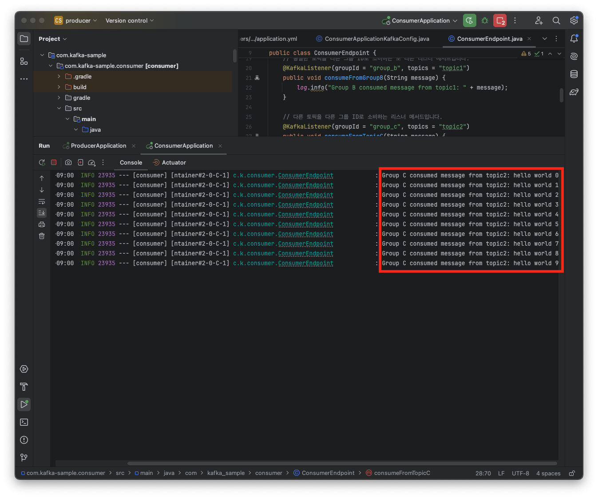
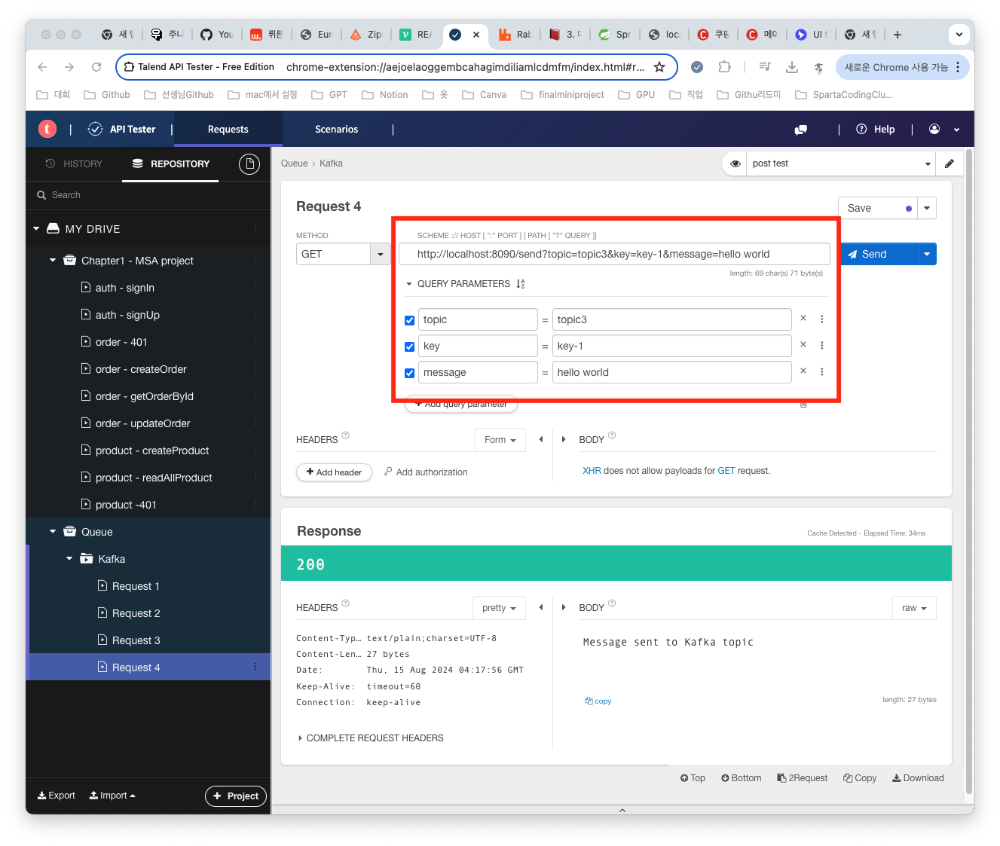
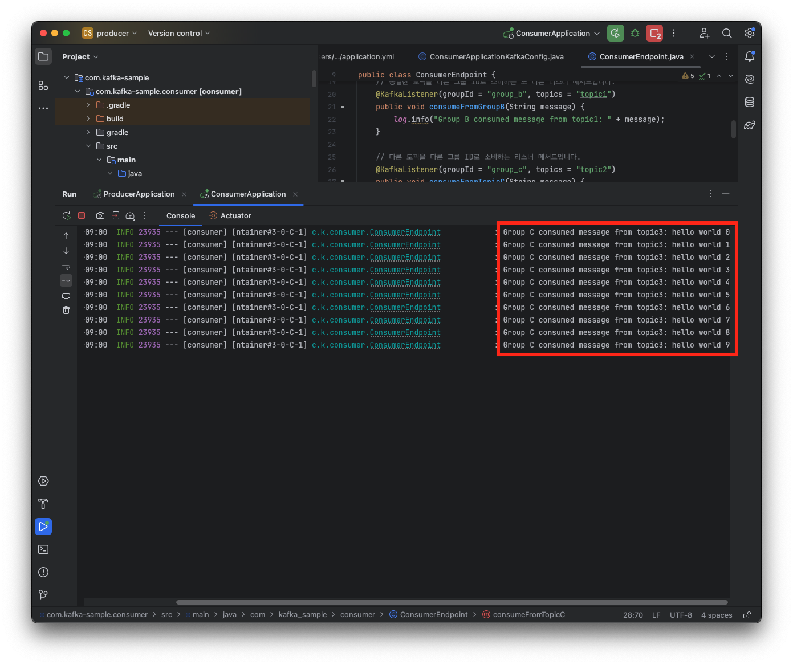
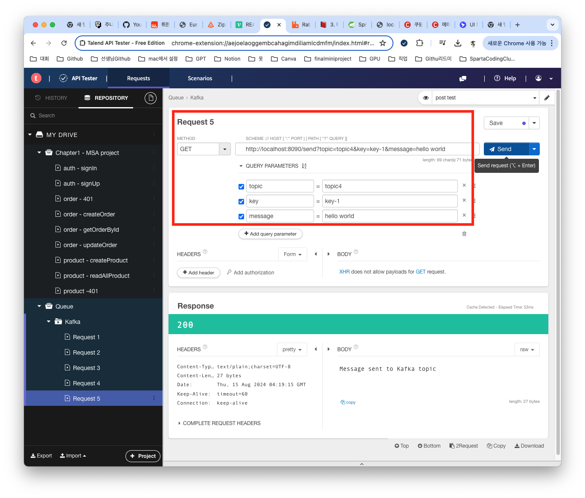
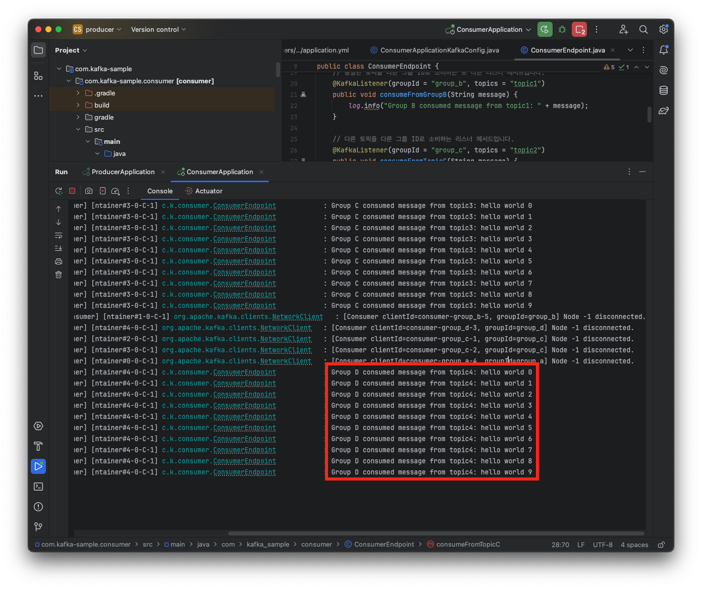

## 🤔 topic과 group의 따라 어떻게 달라질까???
전의 포스팅때는 Kafka를 설치하고 Producer와 Consumer를 생성하고 Test-topic을 생성해서 새롭게 topic을 생성하고 메세지가 전달되는걸 확인해볼 수 있었다. 이번 포스팅때는 topic과 Group들로 서로 다른 경우의 수로 지정을 했을때 어떻게 메세지가 전달되는지 확인를 해보자

### topic을 topic1로 지정하고 요청해보기

> Consumer Application의 로그를 보면 GroupA와 GroupB가 메세지를 수신한것을 볼 수가 있다 따라서 같은 토픽을 가지고 그룹이 다르면 메세지를 각 그룹마다 수신한다는 것을 알 수 있다.

### topic을 topic2로 지정하고 요청해보기

> Consumer Application의 로그를 보면 GroupC이고 topic이 2 인 Listener가 메세지를 수신한 것을 볼 수 있다.

### topic을 topic3로 지정하고 요청해보기

> Consumer Application의 로그를 보면 GroupC이고 이번엔 topic이 3인 Listener가 메세지를 수신한 것을 볼 수 있습니다.

### topic을 topic4로 지정하고 요청해보기

> Consumer Application의 로그를 보면 GroupD이고  topic이 4인 리스너가 메세지를 수신한 것을 볼 수 있다.

같은 토픽이면 다른 그룹이여도 해당 토픽으로 지정하게 되면 그 토픽에 해당되는 그룹에게는 전달 되는걸 확인할 수가 있었고 같은 그룹이여도 토픽이 다르면 토픽에 따라 전달 되는걸 확인을 해볼 수가 있었다 이러한 특징들을 살려서 나중에 프로젝트를 진행할때 적용하면 좋을 것 같다.