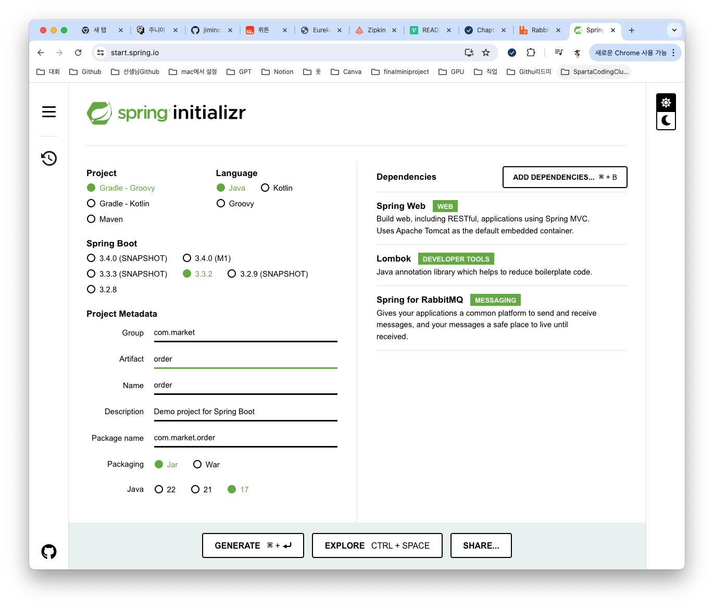
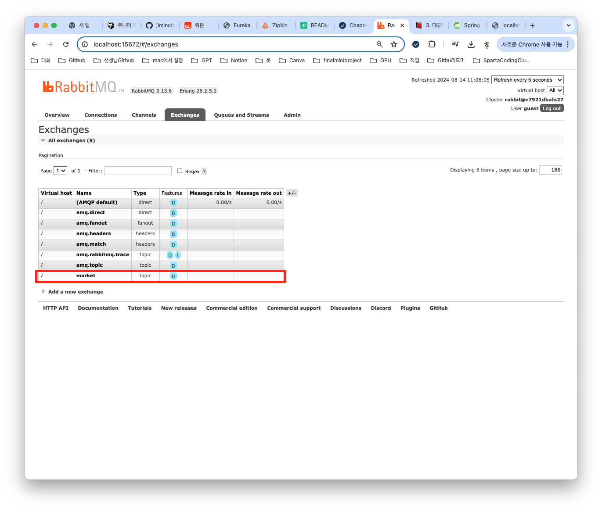
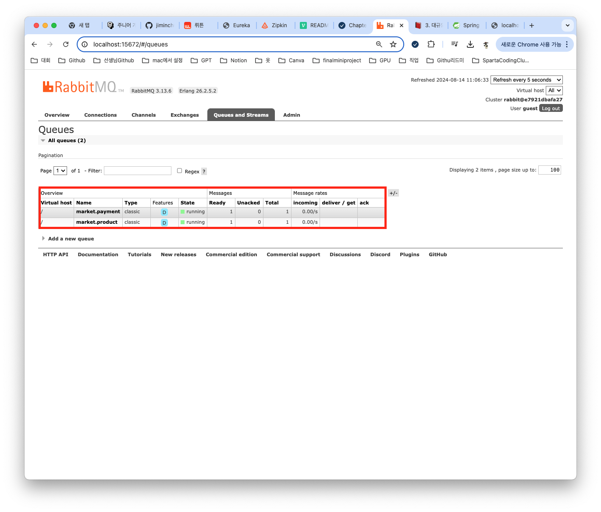
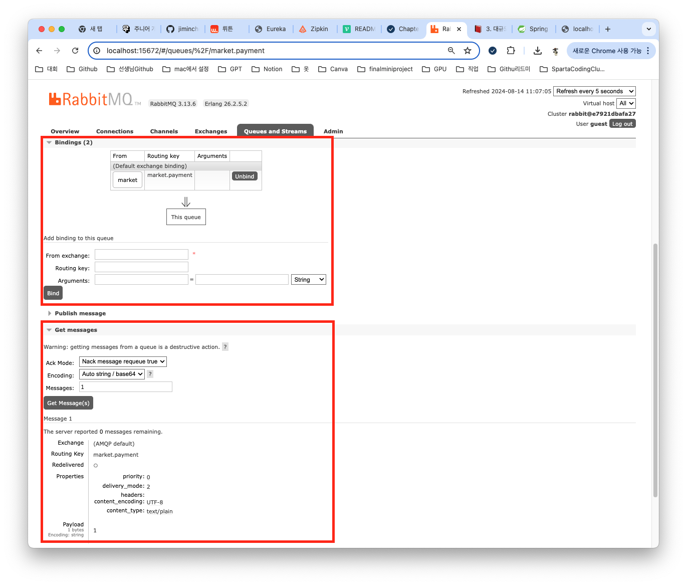
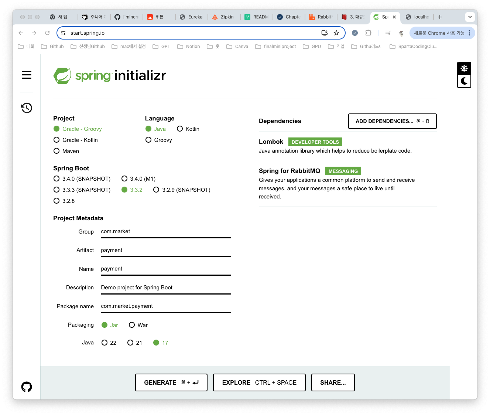
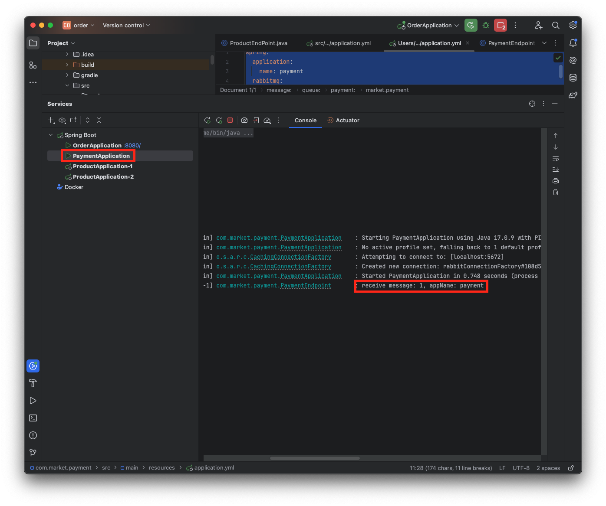

## RabbitMQ를 실습을 진행해보자
실습에 앞서 전체적인 아키텍처를 그려보면 다음과 같다.


Order쪽에서 market exchange를 통해 market.product, market.payment쪽으로 메세지를 전달하고 product쪽은 라운드 로빈 형식으로 로드벨런싱으로 순차적으로 받는 실습과 기본적인 메시징 큐형식으로 받아보는 payment를 실습을 진행 할거다 이번 포스팅에서는 payment쪽을 해보고 다음 포스팅때는 product쪽을 진행해보자 

### RabbitMQ 설치하기
* 도커를 사용해서 RabbitMQ를 설치 하자
```
version: '3.8'

services:
  rabbitmq:
    image: rabbitmq:management
    container_name: rabbitmq
    ports:
      - "5672:5672"
      - "15672:15672"
    restart: unless-stopped
```
* docker-compose up 명령어로 실행하기
```
docker-compose up -d
```
* localhost:15672 로 접속하게 되면 로그인페이지가 보인다. 따로 설정을 안해놨다면 아이디 비밀번호는 다음과 같다.
  * username : guest
  * password : guset

### Order Application 생성하기
* start.spring.io에 접속해서 프로젝트를 생성하자


* application.properties를 삭제하고 application.yml로 생성한뒤 다음과 같이 설정한다.
```
spring:
  application:
    name: order
  rabbitmq:
    host: localhost
    port: 5672
    username: guest
    password: guest
message:
  exchange: market
  queue:
    product: market.product
    payment: market.payment
```
* rabbitmq쪽은 연결하는 부분이라고 생각하면 되고
* message쪽은 exchange와 큐의 이름을 설정하는 것이라고 생각하면 된다.

* OrderApplicationQueueConfig.java
```
import org.springframework.amqp.core.Binding;
import org.springframework.amqp.core.BindingBuilder;
import org.springframework.amqp.core.Queue;
import org.springframework.amqp.core.TopicExchange;
import org.springframework.beans.factory.annotation.Value;
import org.springframework.context.annotation.Bean;
import org.springframework.context.annotation.Configuration;

@Configuration
public class OrderApplicationQueueConfig {

    @Value("${message.exchange}")
    private String exchange;

    @Value("${message.queue.product}")
    private String queueProduct;

    @Value("${message.queue.payment}")
    private String queuePayment;

    @Bean public TopicExchange exchange() { return new TopicExchange(exchange); }

    @Bean public Queue queueProduct() { return new Queue(queueProduct); }
    @Bean public Queue queuePayment() { return new Queue(queuePayment); }

    @Bean public Binding bindingProduct() { return BindingBuilder.bind(queueProduct()).to(exchange()).with(queueProduct); }
    @Bean public Binding bindingPayment() { return BindingBuilder.bind(queuePayment()).to(exchange()).with(queuePayment); }
}
```

* OrderService.java
```
import lombok.RequiredArgsConstructor;
import org.springframework.amqp.rabbit.core.RabbitTemplate;
import org.springframework.beans.factory.annotation.Value;
import org.springframework.stereotype.Service;

@Service
@RequiredArgsConstructor
public class OrderService {

    @Value("${message.queue.product}")
    private String productQueue;

    @Value("${message.queue.payment}")
    private String paymentQueue;

    private final RabbitTemplate rabbitTemplate;

    public void createOrder(String orderId) {
        rabbitTemplate.convertAndSend(productQueue, orderId);
        rabbitTemplate.convertAndSend(paymentQueue, orderId);
    }
}
```

* OrderController.java
```
import lombok.RequiredArgsConstructor;
import org.springframework.web.bind.annotation.GetMapping;
import org.springframework.web.bind.annotation.PathVariable;
import org.springframework.web.bind.annotation.RestController;

@RestController
@RequiredArgsConstructor
public class OrderController {

    private final OrderService orderService;

    @GetMapping("/order/{id}")
    public String order(@PathVariable String id) {
        orderService.createOrder(id);
        return "Order complete";
    }
}
```
### Order Application 실행 해보기
* 실행 후 http://localhost:8080/order/1 로 접속해보면 "Order complete"이라고 잘 뜨는걸 확인할 수 있다.
* localhost:15672에 접속을 해보면 다음과 같다.



> 우리가 Order Application에서 생성한 exchange, queue, binding이 생성 되어있는걸 확인 할 수가 있다.

아직은 프로듀서쪽에서 메세지를 전달해 큐에 적재만 되어있고 이제 payment컨슈머를 생성해서 받아보는걸 해보자

### Payment Application 생성하기
* start.spring.io에 접속해서 프로젝트를 생성하자


* application.properties 삭제 후 application.yml 생성하기
```
spring:
  application:
    name: payment
  rabbitmq:
    host: localhost
    port: 5672
    username: guest
    password: guest
message:
  queue:
    payment: market.payment
```
> 여기서 살펴볼 부분은 message 부분이다. Payment Application 에서 받아야 할 부분은 market.payment 이므로 Order에서 사용했던 나머지 부부은 필요하지 않다.

* PaymentEndpoint.java 생성하기
```
import lombok.extern.slf4j.Slf4j;
import org.springframework.amqp.rabbit.annotation.RabbitListener;
import org.springframework.beans.factory.annotation.Value;
import org.springframework.stereotype.Component;

@Slf4j
@Component
public class PaymentEndpoint {

    @Value("${spring.application.name}")
    private String appName;

    @RabbitListener(queues = "${message.queue.payment}")
    public void receiveMessage(String orderId) {
        log.info("receive orderId:{}, appName : {}", orderId, appName);
    }
}
```
> @RabbitListener 어노테이션을 이용하여 queue에 적재 되어있는 메세지를 받아주고 제대로 오는지 log를 찍어 확인해보자


> 로그기록을 보면 잘오는걸 확인 할 수가 있다. 그렇다면 localhost:15672에 접속해보자

> 전에 적재 되어 있던 market.payment쪽에 메세지가 1에서 0으로 바뀐걸 확인할 수 있다.

## 다음에는..
다음 포스팅때는 product Application을 2개를 생성해서 라운드 로빈형식으로 전달 되는지 확인 해보겠다.