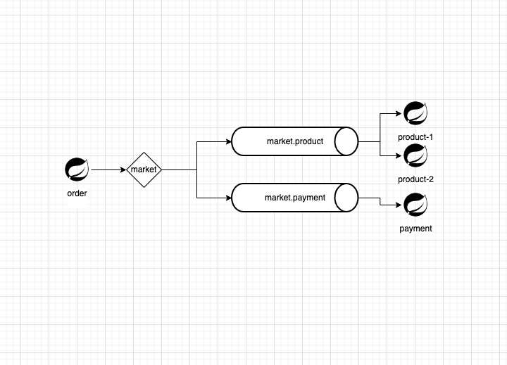
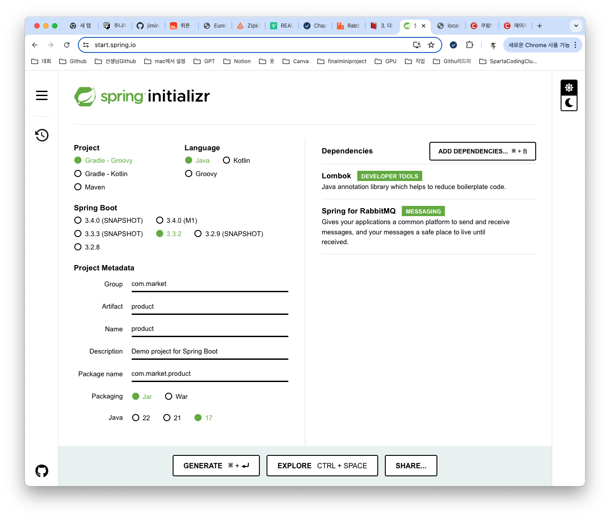
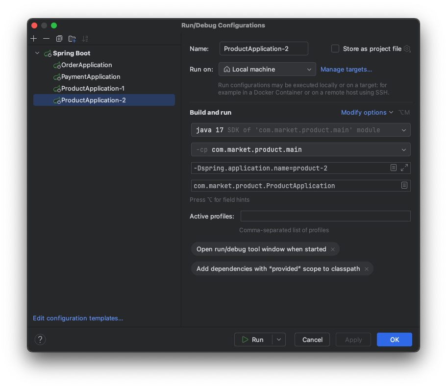
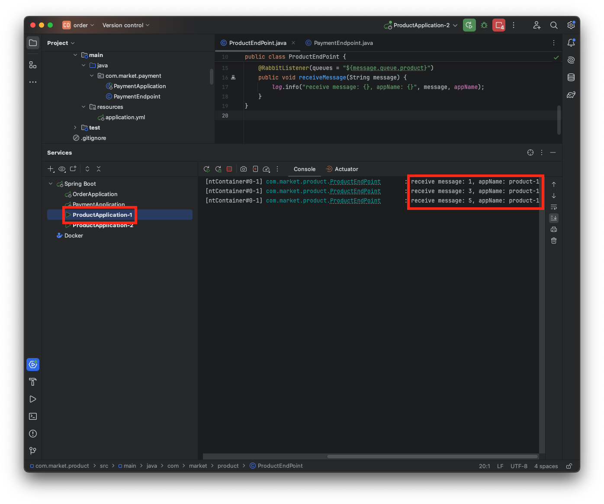

## 전에 실습에 이어서..
전에 실습에서 그려봤던 아키텍처 이다.

전에 실습에서 그려봤던 아키텍처 이다. 오늘은 전에 포스팅에서도 말했었듯이 product application을 2개 생성하고 라운드 로빈형식으로 메세지를 받는 걸 실습을 해보겠다. 프로젝트는 전에 파일을 유지해서 진행했다.

## Product Application 생성하기
* start.spring.io에 접속해서 프로젝트를 생성하자


* application.properties를 삭제하고 application.yml로 생성한뒤 다음과 같이 설정한다. 전에 payment 쪽에서 몇개만 수정하면 된다.
```
spring:
  application:
    name: product
  rabbitmq:
    host: localhost
    port: 5672
    username: guest
    password: guest
message:
  queue:
    product: market.product
```

* ProductEndpoint.java 생성하기
```
import lombok.extern.slf4j.Slf4j;
import org.springframework.amqp.rabbit.annotation.RabbitListener;
import org.springframework.beans.factory.annotation.Value;
import org.springframework.stereotype.Component;

@Slf4j
@Component
public class ProductEndpoint {

    @Value("${spring.application.name}")
    private String appName;

    @RabbitListener(queues = "${message.queue.product}")
    public void receiveMessage(String orderId) {
        log.info("receive orderId:{}, appName : {}", orderId, appName);
    }
}
```

* 구성편집 쪽에서 들어가서 기존 ProductApplication을 복제하고 옵션수정 쪽에서 VM설정을 클릭한 후 application.name옵션을 통해 구분하자
  * 구성편집 > ProductApplication 복제 > 옵션수정 > add VM Option > -Dspring.application.name=product-1
  

## Product-1, Product-2 실행하기
* 이제 http://localhost:8080/order/1 로 여러번 요청을 한 후 로그기록을 살펴보자 
```
http://localhost:8080/order/1
http://localhost:8080/order/2
http://localhost:8080/order/3
http://localhost:8080/order/4
http://localhost:8080/order/5
http://localhost:8080/order/6
```
* Product-1

* Product-2


> 두개의 로그기록을 살펴보면 하나는 홀수번째만 다른 하나는 짝수번째만 찍힌걸 확인 할 수 있다. 이걸로 라운드 로빈 형식으로 잘 왔다는걸 확인 해볼수가 있다.