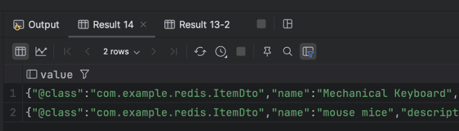

## Spring에서 Redis를 사용해보자 
이전 포스팅때에는 Redis의 기초적인 자료형을 배웠다. 본격적인 서비스에 Redis를 적용하기 전, 연습용 SpringBoot 프로젝트에서 활용해 보자. 먼저, Spring Initialzr를 이용하여 Redis를 사용하기 위한 최소한의 프로젝트를 만들어본다.


의존성은 사진과 같이 lombok,spring web, spring data redis만 추가를 해주었다.

## RedisTemplate 써보기
간단한 CRUD로 RedisTemplate를 사용하여 Redis를 활용해 보겠다.
* RedisTemplateTests.java 생성하기
* StringRedisTemplate 추가
```
@SpringBootTest
public class RedisTemplateTests {
    @Autowired
    private StringRedisTemplate stringRedisTemplate;
    
    // ...
}
```
### stringValueOpsTest()
```
@Test
public void stringValueOpsTest() {
    ValueOperations<String, String> ops = stringRedisTemplate.opsForValue();
    ops.set("simplekey", "simplevalue");
    System.out.println(ops.get("simplekey"));
    ops.set("greeting", "hello redis!");
    System.out.println(ops.get("greeting"));
}
```
* 여기에는 지금 사용한 set, get 말고도, Map과 사용할 수 있는 multiSet, Collection과 사용할 수 있는 multiGet 등, 원래 String 데이터 타입을 기준으로 사용하던 다양한 명령들이 메서드로 구현되어 있다. 
* 이를 이용하면 Redis에 직접 명령을 전달하듯이 기능을 구현할 수 있습니다.
### stringSetOpsTest()
```
@Test
public void stringSetOpsTest() {
    SetOperations<String, String> setOps = stringRedisTemplate.opsForSet();
    setOps.add("hobbies", "games");
    setOps.add("hobbies", "coding");
    setOps.add("hobbies", "alcohol");
    setOps.add("hobbies", "games");
    System.out.println(setOps.size("hobbies"));
}
```
* 만약 저희가 다루고 싶은 데이터 타입이 Set이라면, opsForSet()을 활용할 수 있습니다.
### @Configuration에서 RedisTemplate 정의하기
#### ItemDto.java
```
@Getter
@ToString
@Builder
@NoArgsConstructor
@AllArgsConstructor
public class ItemDto {
    private String name;
    private String description;
    private Integer price;
}
```
* `@RedisHash`가 적용된 `Item` 대신 사용할 `ItemDto`를 만들어 보았다.
#### RedisConfig.java
```
@Configuration
public class RedisConfig {
    @Bean
    public RedisTemplate<String, ItemDto> itemRedisTemplate(
            RedisConnectionFactory connectionFactory
    ) {
        RedisTemplate<String, ItemDto> template = new RedisTemplate<>();  
        template.setConnectionFactory(connectionFactory);                 
        template.setKeySerializer(RedisSerializer.string());              
        template.setValueSerializer(RedisSerializer.json());              
        return template;                                                  
    }
}
```
* RedisTemplate<String, ItemDto> template = new RedisTemplate<>();
  * RedisTemplate를 만들어서 타입파라미터를 Strign,ItemDto로 설정한다.
* template.setConnectionFactory(connectionFactory);                 
  * Redis와 연결을 담당할 RedisConnectionFactory를 template에 전달한다. application.yml에 내용으로 내부적으로 만들어 Bean에 등록하게 된다.
* template.setKeySerializer(RedisSerializer.string());              
  * 직렬화 방법을 결정한다.
  * Key는 문자열로 직렬화 역직렬화를 진행
* template.setValueSerializer(RedisSerializer.json());
  * 직렬화 방법을 결정한다.
  * Value는 데이터를 Json으로 직렬화 한다.
#### itemRedisTemplateTest()
```
@Test
public void itemRedisTemplateTest() {
    ValueOperations<String, ItemDto> ops = itemRedisTemplate.opsForValue();
    ops.set("my:keyboard", ItemDto.builder()
            .name("Mechanical Keyboard")
            .price(300000)
            .description("Expensive 😢")
            .build());
    System.out.println(ops.get("my:keyboard"));

    ops.set("my:mouse", ItemDto.builder()
            .name("mouse mice")
            .price(100000)
            .description("Expensive 😢")
            .build());
    System.out.println(ops.get("my:mouse"));
}
```
#### MGET으로 저장되었는지 확인하기
