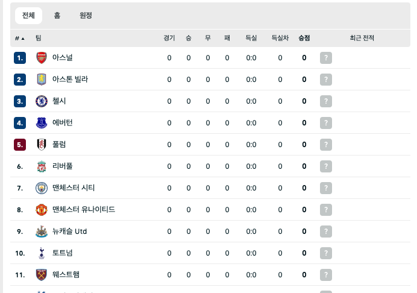
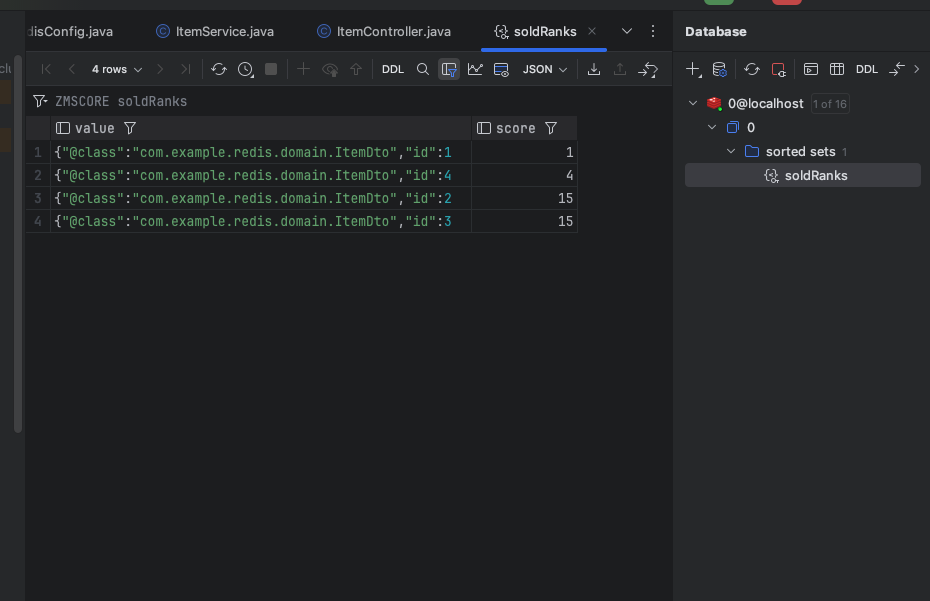
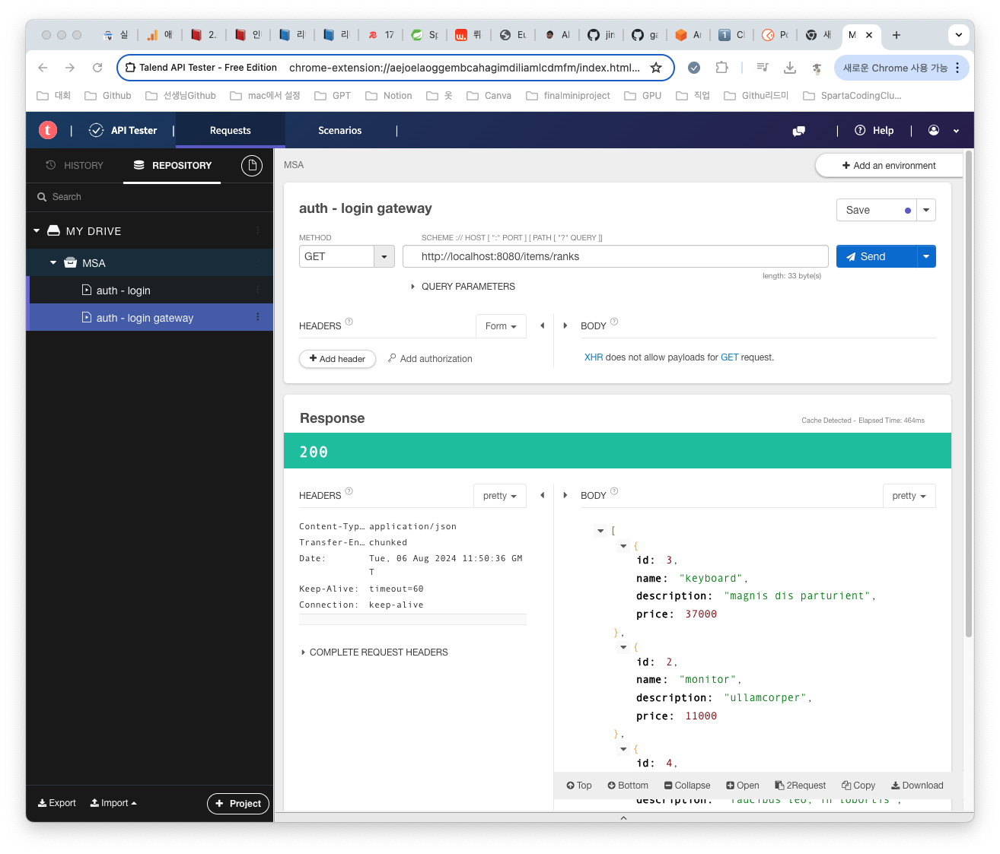

## 리더보드 기능

리더보드란 실시간 랭킹을 볼수있는 기능이다. 위에 사진은 축구순위표여서 다르긴하지만 순위표라는 점에서 사진을 가져왔다. 게임분야에서는 점수순위, 랭크순위 검색엔진이라면 실시간검색순위 이커머스 분야라면 실시간 인기상품과 같은 기능들을 보여주기 위해 사용할 수 있다.

## 인기상품 리더보드 만들기
우리는 전에 redis에서 배웠던 SortedSet를 이용하여 리더보드를 만들어 볼까 한다.

코드는 [👉🏻 GitHub 링크](https://github.com/jiminchur/Study_Redis/tree/2-2)에 들어가면 확인할 수 있다.

우리는 기능구현을 위한 부분만 보도록 하자.

* RedisConfig.java 파일 생성
* @Bean itemRedisTemplate() 작성
```
@Bean
public RedisTemplate<String, ItemDto> rankTemplate (
        RedisConnectionFactory redisConnectionFactory
) {
    RedisTemplate<String, ItemDto> template = new RedisTemplate<>();
    template.setConnectionFactory(redisConnectionFactory);
    // 주어진 데이터를 어떻게 직렬화 할것인지
    template.setKeySerializer(RedisSerializer.string());
    template.setValueSerializer(RedisSerializer.json());
    return template;
}
```
* RedisTemplate으로 SortedSet을 사용한다면, ZSetOperations가 필요하다.
* ItemService.java 파일에 ZSetOperations 추가
```
@Slf4j
@Service
@RequiredArgsConstructor
public class ItemService {
    private final ItemRepository itemRepository;
    private final OrderRepository orderRepository;
    private final ZSetOperations<String, ItemDto> rankOps; // 추가
    
    public ItemService(
            ItemRepository itemRepository,
            OrderRepository orderRepository,
            RedisTemplate<String, ItemDto> rankTemplate // 추가
    ) {
        this.itemRepository = itemRepository;
        this.orderRepository = orderRepository;
        this.rankOps = rankTemplate.opsForZSet() // 추가
    }
}
```
* 기존 purchase 매서드에서 incrementScore 호출
```
public void purchase(Long id) {
    Item item = itemRepository.findById(id)
            .orElseThrow(() -> new ResponseStatusException(HttpStatus.NOT_FOUND));
    orderRepository.save(ItemOrder.builder()
            .item(item)
            .count(1)
            .build());
    rankOps.incrementScore( // 추가
            "soldRanks", 
            ItemDto.fromEntity(item), 
            1
    );
}
```
* incrementScore 메서드는 SortedSet의 ZINCRBY 명령과 동일한 역할을 한다.
  * 만약 전달되는 데이터가 없더라도 추가하고 점수를 더해준다.

* 물품 반환하는 getMostSold 생성하기
```
public List<ItemDto> getMostSold() {
    Set<ItemDto> ranks = rankOps.reverseRange("soldRanks", 0, 9);
    if (ranks == null) return Collections.emptyList();
    return ranks.stream().toList();
}
```
* 마지막으로 ItemController.java에 전체 순위표 출력하는 /ranks 생성하기
```
@GetMapping("/ranks")
    public List<ItemDto> getRanks(){
        return itemService.getMostSold();
    }
```
* 테스트를 위해서 sql 쿼리문으로 데이터를 삽입해 놓았다. [👉🏻 해당 링크](https://github.com/jiminchur/Study_Redis/blob/2-2/com.sparta.redis.rank/src/main/resources/data.sql)

* POST요청으로 데이터 여러번 요청 후 Redis의 데이터 확인하기

* 순위표 출력하기


