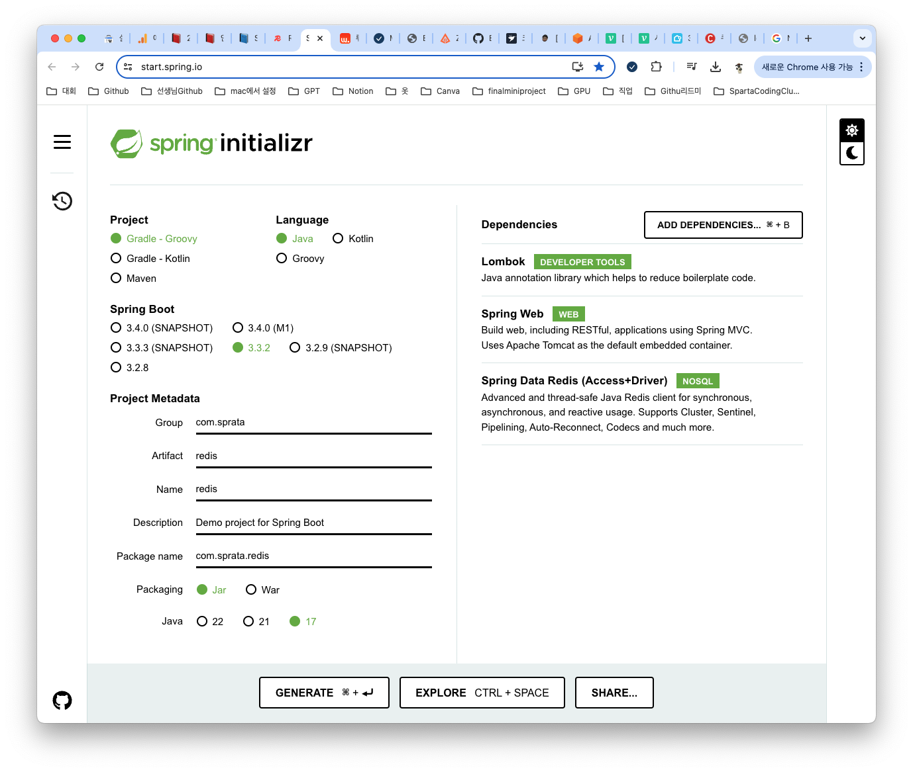
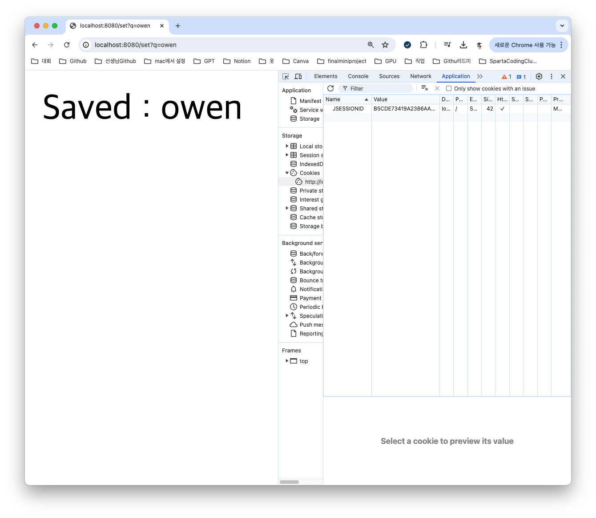
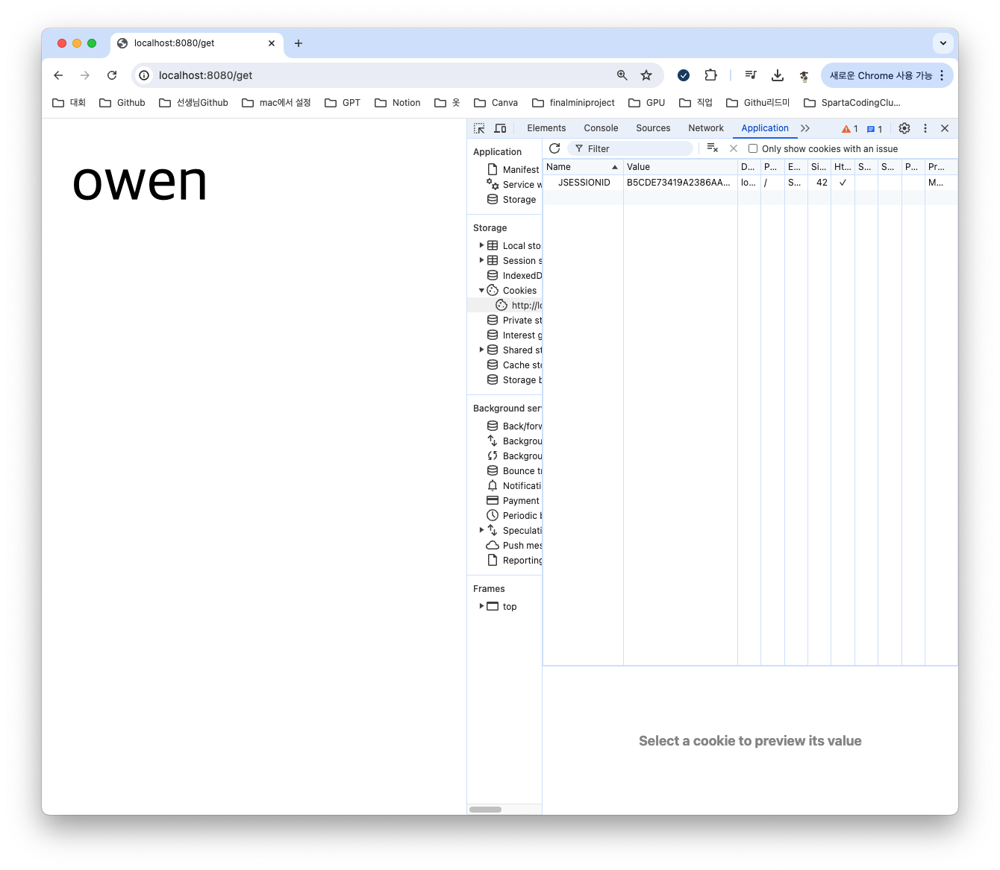
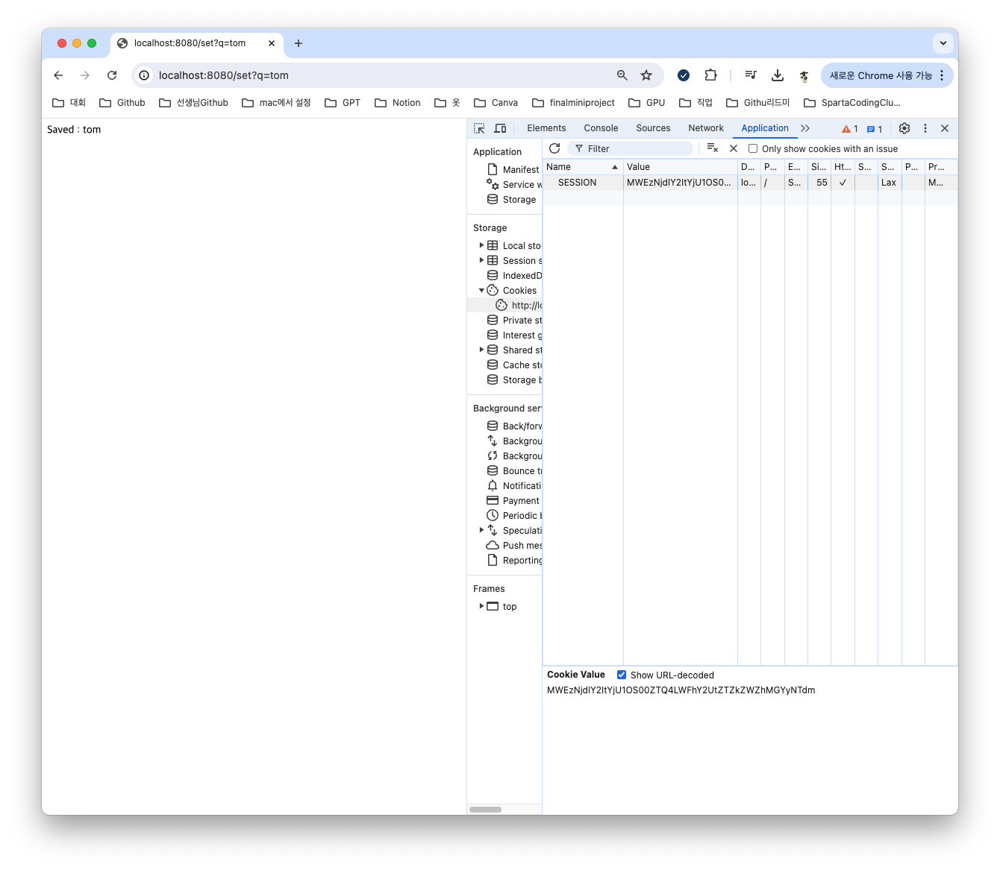
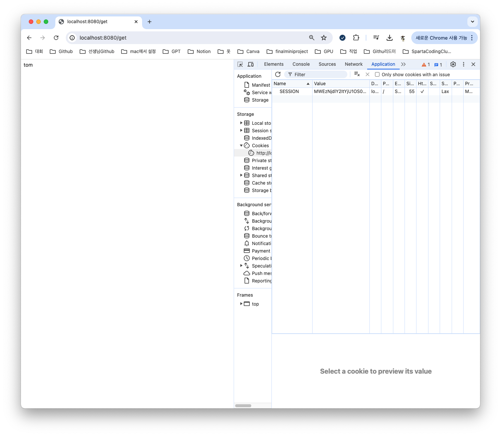
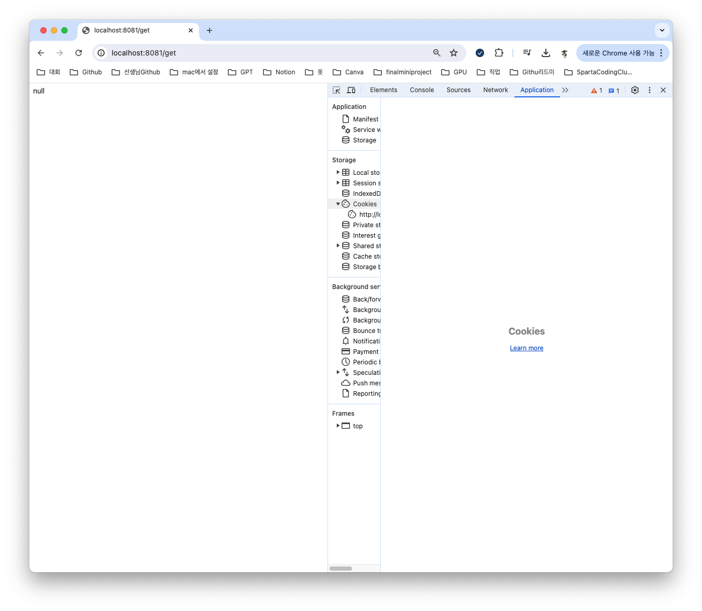
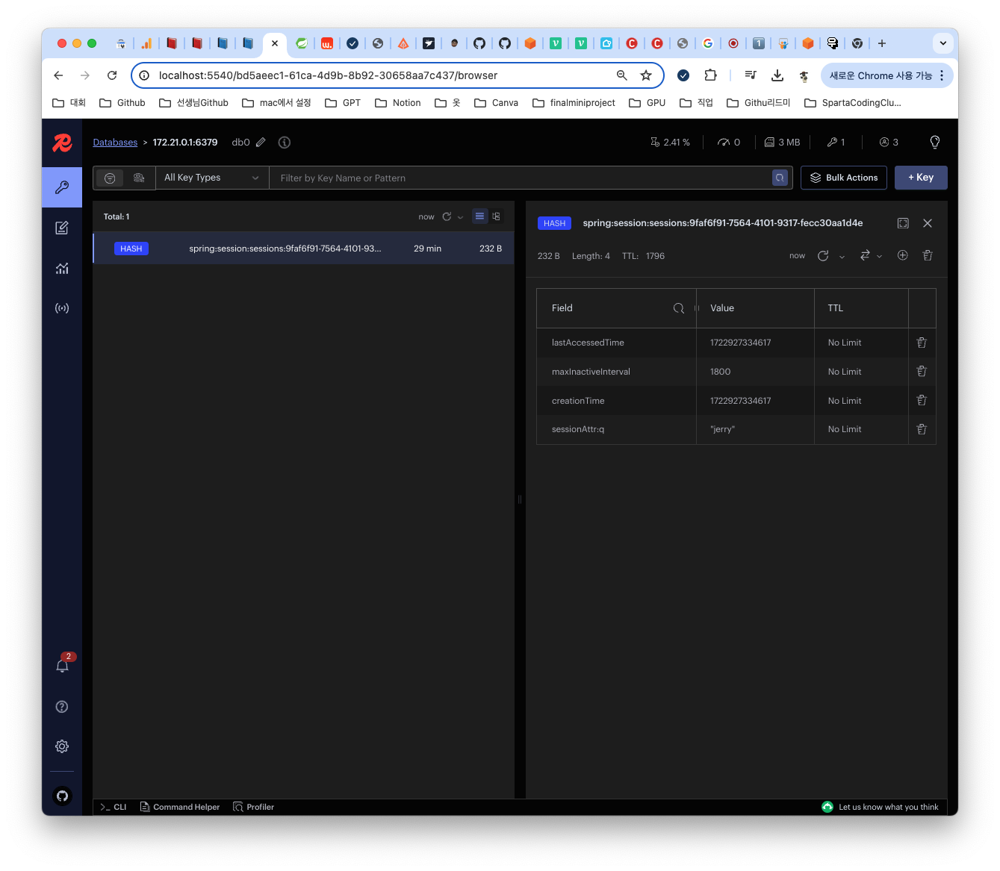

## HttpSession이란??
> HttpSession은 Java의 인터페이스(interface)이며, 이를 사용하여 세션(session)을 제어할 수 있습니다. session은 쿠키(cookie)의 트래픽(traffic) 이슈(issue)와 cookie 변경으로 인한 보안 issue를 해결하기 위해 등장했습니다.
라고 구글에 검색을 하면 제일 먼저 나온다. HTTP요청에는 상태가 없으며 각각의 요청이 독립적으로 이뤄지며 서버는 사용자가 보낸 몇번째 요청인지를 저장하지 않는다. 즉, 사용자 브라우저 측에서 자신을 식별할 수 있는 정보를 서버에 요청할때 마다 알려줘야 한다.

이때 사용자의 브라우저에 응답을 보내면서, 브라우저에 특정 데이터를 저장하도록 전달할 수 있다. 이때 서버에서 작성해서 응답을 받은 브라우저가 저장하는 데이터를 `쿠키`라고 부른다.

쿠키에 요청을 보낸 브라우저를 특정값을 보내줄 수 있다. 이후 사용자가 요청하면 서버에 저장해놓은 정보로 누구인지 구분할 수 있다. 이런식으로 상태를 저장하지 않는 HTTP 통신을 사용하면서, 이전에 요청을 보낸 사용자를 기억하는 상태를 유지하는 것을 `세션`이라고 부른다.

SpringBoot를 사용하면, Tomcat 서버가 세션을 생성한다. 그리고 JSESSIONID라는 쿠키 값은 서버 내부의 Tomcat이 처음 접근하는 브라우저에게 발급하는 쿠키이다. Tomcat은 이 쿠키의 값을 바탕으로 세션을 관리하고, HttpSession 객체로 만들어 주고, Spring Boot는 HttpSession을 가져와 사용할 수 있다.

### 실습해보기
* com.sparata.redis 서버 생성하기

* SessionController.java 파일 생성하기
```
@RestController
public class SessionController {
    @GetMapping("/set")
    public String set(
            @RequestParam("q")
            String q,
            HttpSession session
    ) {
        session.setAttribute("q", q);
        return "Saved: " + q;
    }

    @GetMapping("/get")
    public String get(
            HttpSession session
    ) {
        return String.valueOf(session.getAttribute("q"));
    }
}
```
* test 하기



### Scale-Out Test
사용자가 급증해서 Scale-Out를 했다. 지금 현재 A서버,B서버가 있다고 하면 사용자가 A 서버로 요청을 했다가, B 서버로 요청을 하게 된다면 세션이 유지될 수 있을까?? 한번 알아보자

* 8081 생성하기
* [👉🏻 [SpartaCodingClub] JAVA 단기 심화 부트캠프 TIL (3)](https://jiminchur.github.io/my-first-article/sparta3/)
여기서 자세하게 다루니 추가적으로 적진 않겠다.

* Redis를 연결하지 않고 우선 test




8080포트에서는 정상적으로 작동을 했지만 8081로 오니까 null로 리턴되는 걸 알 수가있다.

## Sticky Session
사용자가 보낸 요청을 하나의 서버로 고정하는 방법이다. 요청을 분산하는 로드밸런서를 통해 요청을 보낸 사용자를 기록, 해당 사용자가 다시 요청을 할 경우 최초로 요청이 전달된 서버로 요청을 전달하는 방식이다.

그런데 만약 3개의 서버가 있는데 하나의 서버에서 세션을 사용한 사람들만 남으면 어떻게 될까??

과부하로 이어질수 있으며 만약 서버가 다운되면 세션이 사라지게되고 자기 데이터도 사라질 수가 있다.

## Session Clustering
그래서 떠오르는 대안이 Session Clustering이다. 해당 저장소에 세션에 대한 정보를 저장함으로서, 요청이 어느 서버로 전달이 되든 세션 정보가 유지될 수 있도록 하는 방법이다.

다만, 이렇게 될 경우 서버 외부에 세션을 저장하는 것이므로, 관리 포인트가 늘어나게 되며, 통신 과정에서 어쩔 수 없는 지연이 발생합니다. 그래서 지연이 적은 Redis와 같은 인메모리 데이터베이스가 많이 사용된다.

## Session Clustering 실습하기
* 의존성 추가하기
```
implementation 'org.springframework.session:spring-session-data-redis'
```
* 원래 안됬던 8081 작동 되는지 확인하기

* 더이상 Tomcat을 사용하지 않기 때문에 JSESSIONID 대신 SESSION이라는 새로운 쿠키를 사용
* Redis 확인하기


잘 작동하는 걸 확인 할 수가 있다.