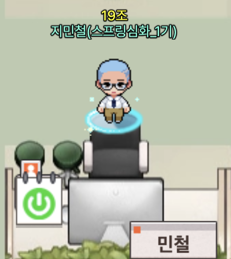

## 🧐 "백엔드 단기 심화과정 모집!!"
"개발자로 마지막 도전!!"

[SpartaCodingClub Java 단기심화 부트캠프 링크 ](https://nbcamp.spartacodingclub.kr/advanced-java)

스파르타코딩 클럽에서 단기심화과정으로 백엔드 부트캠프를 모집을 시작했다.
그전에 나는 엔코아아카데미에서 데이터엔지니어링을 수강하고 데이터 엔지니어가 되기위해 여러가지 기술스택을 공부하고 학습하던 와중 KDT을 참여했어도 추가 수강 가능한 부트캠프의 광고를 봐버리고야 말았다!!

## 🤔 데이터 엔지니어를 준비한다면서 왜 백엔드 부트캠프를 들어???

지원을 하기전 나는 수없이 고민을 했다. 취업을 준비하고 있고 신입 데이터 엔지니어를 준비하고 있는데 갑자기 백엔드 부트캠프를 듣는다고?! 혼자서 고민을 하고 현업에 계신 분들의 조언도 듣기도 하면서 여러가지 생각이 들었다. 그래도 결국에 선택하게 된 이유는 다음과 같다!

* 백엔드와 데이터엔지니어의 접점이 많다는것!!

스파르타코딩클럽 커리큘럼만봐도 내가 데엔을 준비하면서 봤던 기술스택들을 많이 볼수가 있었다. 그리고  결국 데이터 엔지니어가 될려면 백엔드부터 배워야 한다는 말이 현업에 계신 분들이 많이 해주셨던 말이였다.

* 백엔드에 대해서 밑바닥이 아니라는 사실!!

전에 엔코아 부트캠프에서 수강당시 JavaSpring으로 web구현하는 강의를 듣기도 하고 프로젝트를 위해서 내가 직접 독학으로 공부해서 웹을 구현한 경험이 있다.

* 다양한 커뮤니티와 밀착 관리!!

현재 나로써는 전에 부트캠프 수강생과 카카오톡 오픈채팅방분들이 나의 커뮤니티 전부이다. 개발자로써 커리어를 이어나갈려면 커뮤니티를 잘 생성한다는걸 알고 있었다. 한정된 사람들과 커뮤니티를 활성화 하다보니 더 많은정보와 더 많은 생각들을 놓치는 부분이 있다. 이번 부트캠프를 수강 하면서 또 다른 좋은 분들과 좋은 커뮤니티를 생성하고 싶다!!

전에 엔코아 부트캠프에서 크게 아쉬웠던점은 사후관리이지 싶다.. 커리큘럼이나 교육에 대해서는 대만족을 하였지만 부트캠프 수료 후 몇주동안만 잠깐 신경을 써주고 그 이후엔 완전 나몰라라 였던거 같다.. 물론 이후에 취업이나 공부에 대해서는 스스로 해결해 나가야하지만.. 아쉬웠다..

## 🤓 항상 기대되는 첫 시작!!

오늘 드디어 대략 3개월동안의 과정이 시작된다.

온라인으로 진행하는 부트캠프 다 보니 조금 걱정되는 부분들이 있었지만 많은 튜터분들과 매니저님들이 ZEP상에서 돌아다니시면서 관리해주시고 Slack으로 소통하시고 좀 좋았던 거 같다.

초반에 출석 QR이 문제가 생겨서 난리가 날뻔 했지만 모두가 한마음이 된듯이 척척 해결하더니 금방 해결이 되었다.

사전 OT랑 첫날 수업때는 ZOOM으로 진행 했는데 이후부터는 zep이라는 메타버스 플랫폼에서 진행 한다고 한다.

## 🫡 안녕 나의 팀원들

총 100명의 수강생들중 나는 19조로 편성이 되었다. 5명이 편성이 되었지만 오늘은 한분이 오시질 않았다...내일은 오시겠지..?? 이후 간단한 자기소개와 팀의 규칙 팀장선발을 한 후 각자 개인 공부를 시작하며 부트캠프를 시작하였다.

## 🤟🏻 첫날 느꼈던 단기심화과정의 장점
* 혼자 독학하는 분위기를 잘 만들어준다.
* 일반 과정이 아니라 심화과정이다 보니 다들 개발을 하시다가 오신분들이다!
* 다들 의지가 대단하신거 같다!
* 강의의 퀄이 좋은거 같다!! 
* 오프라인 못지않게 피드백이 빠르다!!

