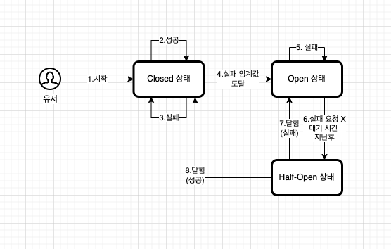
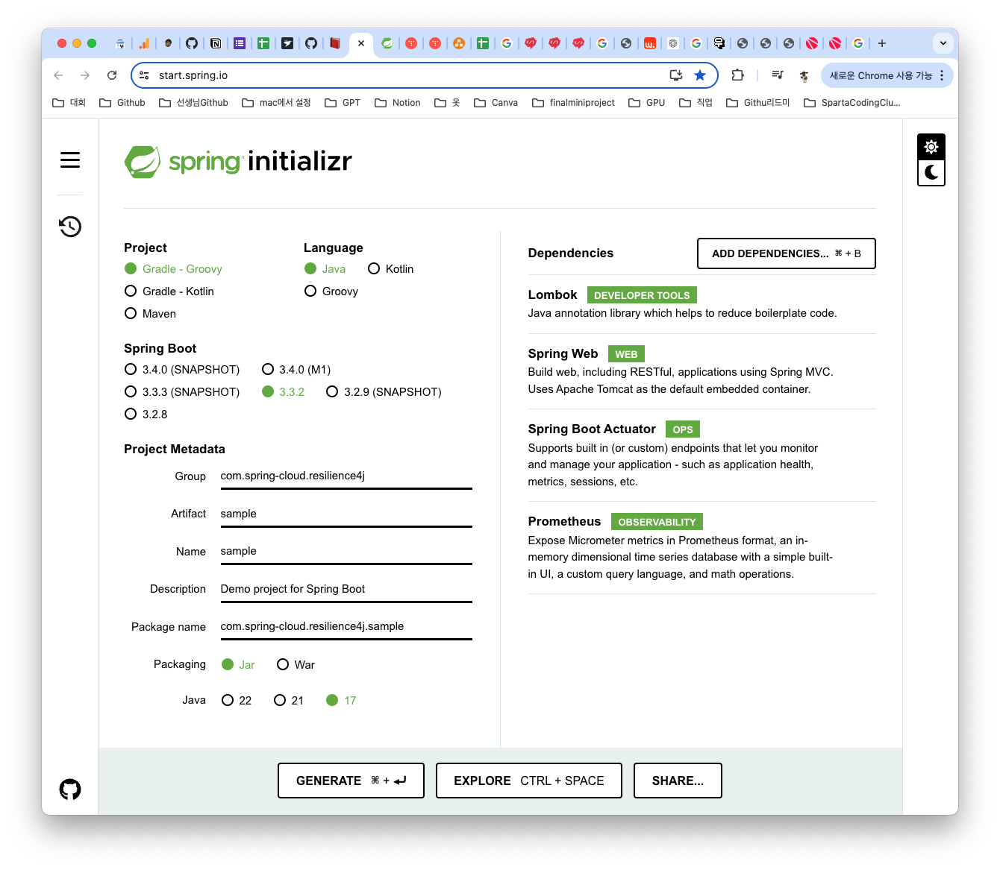
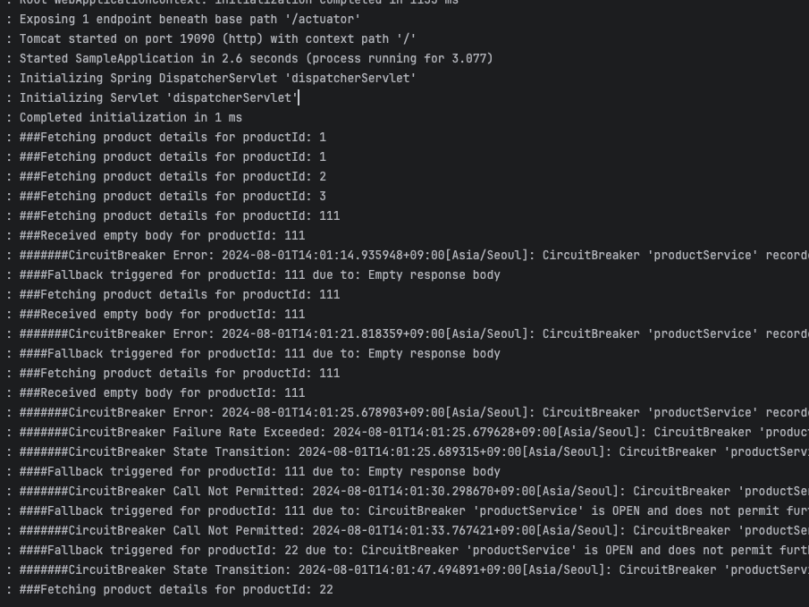
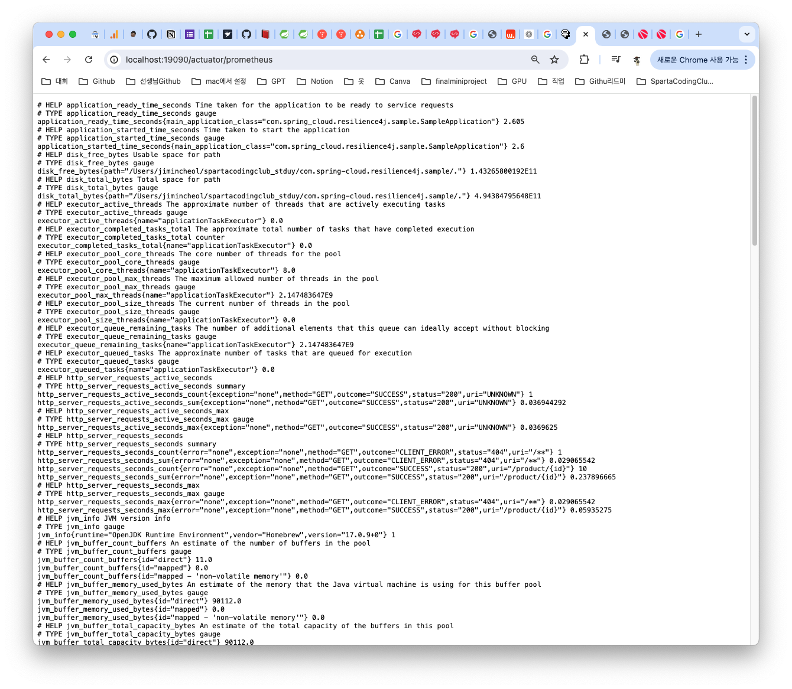
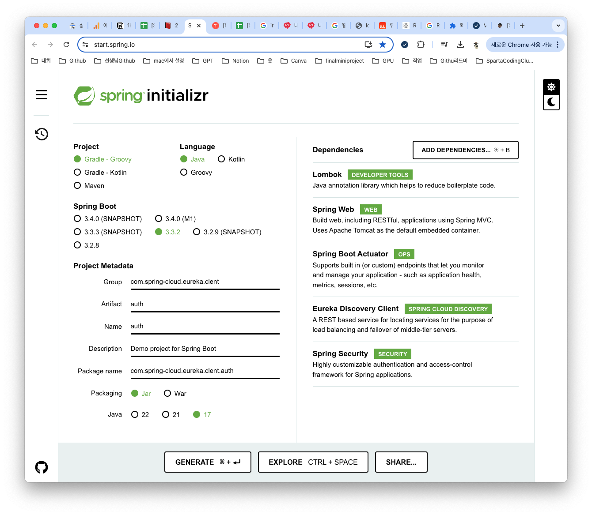
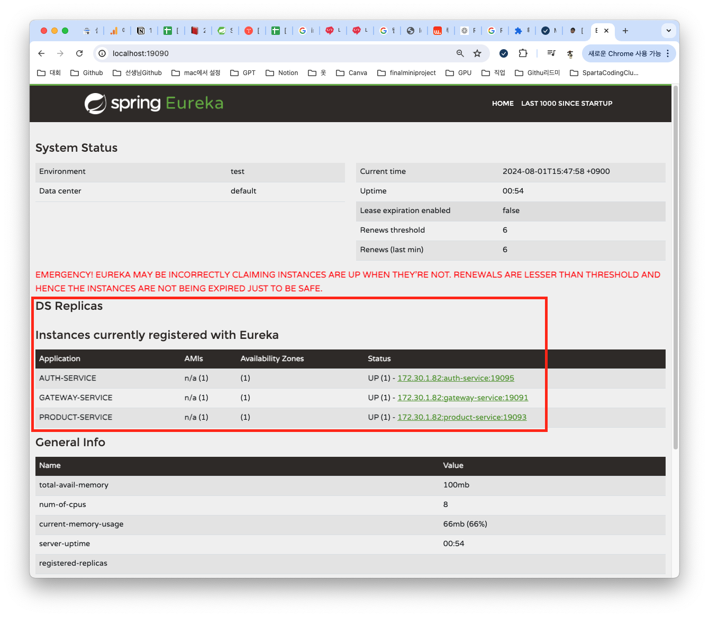
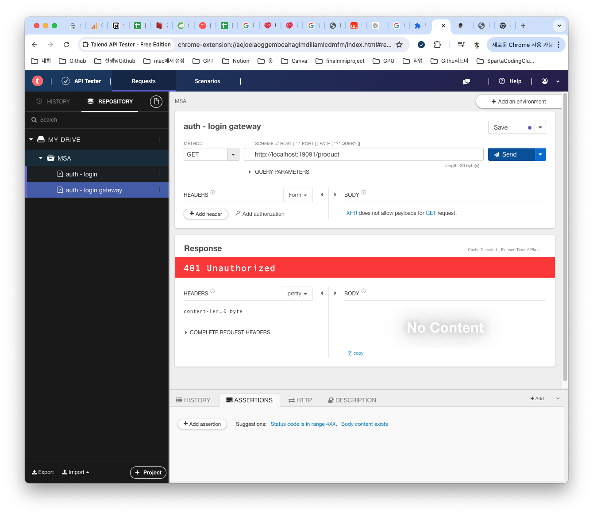
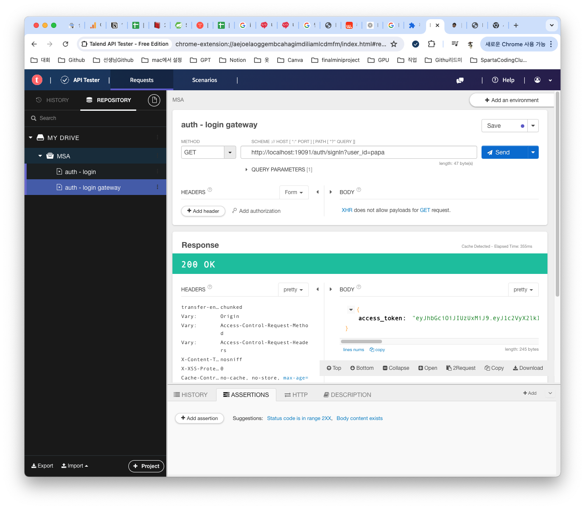
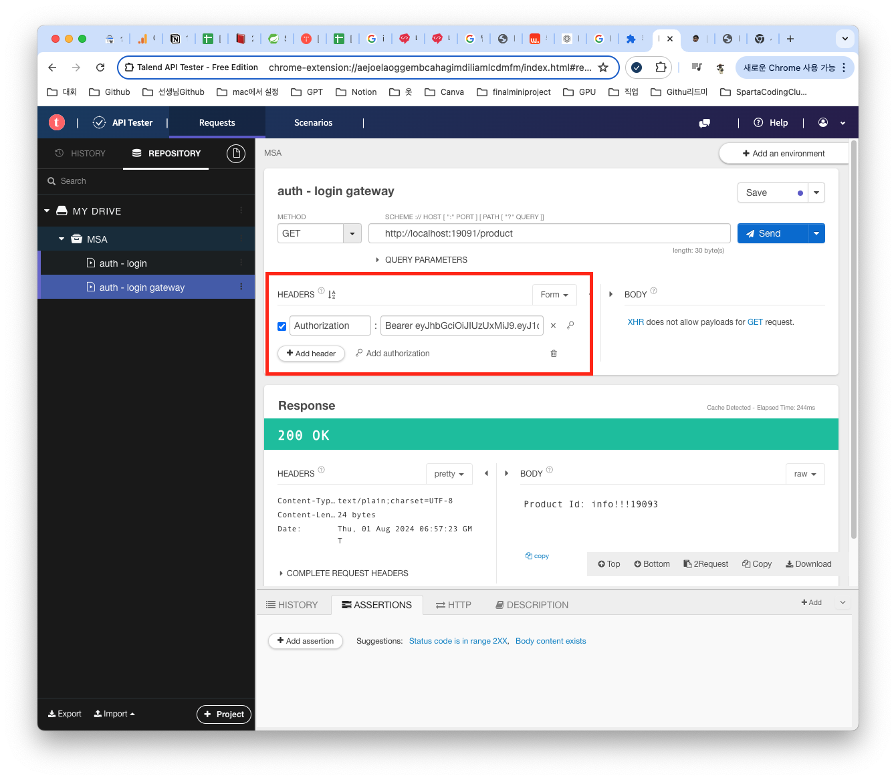

## 🙌🏻 오늘의 코드카타
오늘의 코드 카타 문제는 ***둘만의 암호*** 이다.
* 문제 링크 [프로그래머스 - Level1 - 둘만의 암호](https://school.programmers.co.kr/learn/courses/30/lessons/155652?language=java)

* 문제를 풀기전에 설계를 하자면 a-z를 리스트화 하고 skip에 단어들을 제거하고 index 만큼 숫자를 세고 출력한다.

* 문제풀이
```
import java.util.ArrayList;
import java.util.List;

public class Solution {
    public String solution(String s, String skip, int index) {
        StringBuilder answer = new StringBuilder();
        List<Character> allList = new ArrayList<>();
        
        // 알파벳 a-z를 리스트에 추가
        for (char c = 'a'; c <= 'z'; c++) {
            allList.add(c);
        }

        for (char k : s.toCharArray()) {
            int currentIndex = allList.indexOf(k);
            int steps = index;

            // 다음 인덱스를 찾기 위한 반복
            while (steps > 0) {
                currentIndex = (currentIndex + 1) % allList.size();
                // skip에 포함되지 않은 경우에만 steps 감소
                if (skip.indexOf(allList.get(currentIndex)) == -1) {
                    steps--;
                }
            }

            answer.append(allList.get(currentIndex));
        }
        
        return answer.toString();
    }
}
```
## 🎒 오늘의 강의
오늘의 강의 목표는 1-6,7,8을 수강하고 복습하는게 목표이다. 어제에 이어서 시작해보겠다.

### 서킷브레이커
")
> 마이크로 서비스 사이의 통신이 이루어지는 대규모 시스테 환경에서 느리거나 응답하지 않은 다운스트림 서비스가 발생했을 때 그 피해를 최소화시키는 것이 서킷 브레이커의 가장 큰 핵심이라고 할 수 있다.

#### Resilience4j란?
>Resilience4j는 Netflix Hystrix로부터 영감을 받은 함수형 프로그래밍(functional programming)으로 설계된, 경량의 내결함성(fault tolerance) 라이브러리입니다.
* Resilience4j는 서킷 브레이커 라이브러리로, 서비스 간의 호출 실패를 감지하고 시스템의 안정성을 유지한다.

Resilience4j의존성은 spring starter에서 검색하면 나오긴 하지만 추가해서 사용하진 않고 따로 의존성을 추가할거다
```
dependencies {
    implementation 'io.github.resilience4j:resilience4j-spring-boot3:2.2.0'
	  implementation 'org.springframework.boot:spring-boot-starter-aop'
}
```
#### .yml 파일 한번 확인하기
```
resilience4j:
  circuitbreaker:
    configs:
      default:  
        registerHealthIndicator: true  
        slidingWindowType: COUNT_BASED  
        slidingWindowSize: 5  
        minimumNumberOfCalls: 5  
        slowCallRateThreshold: 100  
        slowCallDurationThreshold: 60000  
        failureRateThreshold: 50
        permittedNumberOfCallsInHalfOpenState: 3
        waitDurationInOpenState: 20s  
```
* registerHealthIndicator: true
  * 애플리케이션의 헬스 체크에 서킷 브레이커 상태를 추가하여 모니터링 가능
* slidingWindowType: COUNT_BASED 
  * 슬라이딩 윈도우의 크기를 설정
  * COUNT_BASED : 최근 N번의 호출을 저장
  * TIME_BASED : 최근 N초 동안의 호출을 저장
* slidingWindowSize: 5  
  * 슬라이딩 윈도우 크기 설정, 5번 호출로 설정
* minimumNumberOfCalls: 5
  * 서킷브레이커가 동작하기 위해 최소한 호출수
* slowCallRateThreshold: 100  
  * 느린호출비율이 100% 넘어가면 Open 상태
* slowCallDurationThreshold: 60000  
  * 느린 호출의 기준시간 설정, 60초 이상이면 느린호출로 간ㄴ주
* failureRateThreshold: 50
  * 실패율이 50% 이상이면 Open 상태
* permittedNumberOfCallsInHalfOpenState: 3
  * Half-open 상태에서 허용하는 최대 호출 수를 3으로 설정
* waitDurationInOpenState: 20s
  * Open -> Half-open 상태로 전환되기전 대기시간

#### fallback 매커니즘 설명

1. 서킷브레이커는 처음에 Colsed 상태로 유지 된다.
2. 성공을 하면 그대로 유지
3. 실패를 해도 그대로 유지
4. 만약 실패율이 임계값에 도달하게 되면 Open 상태가 된다.
5. Open 상태에서 실패를 하면 유지
6. 실패 요청이 없고 대기시간이 지나면 Half-Open 상태가 된다.
7. Half-Open 상태에서 1번이라도 실패함면 다시 Open 상태가 된다.
8. Half-Open 상태에서 계속 성공을 하게되면 Closed 상태가 된다.

#### 실습하기

* 의존성 추가
```
dependencies {
    implementation 'io.github.resilience4j:resilience4j-spring-boot3:2.2.0'
	  implementation 'org.springframework.boot:spring-boot-starter-aop'
}
```
* product 파일 생성
```
import lombok.AllArgsConstructor;
import lombok.Data;
import lombok.NoArgsConstructor;

@Data
@AllArgsConstructor
@NoArgsConstructor
public class Product {

    private String id;
    private String title;

}
```
* productcontroller 파일 생성
```
import lombok.RequiredArgsConstructor;
import org.springframework.web.bind.annotation.GetMapping;
import org.springframework.web.bind.annotation.PathVariable;
import org.springframework.web.bind.annotation.RestController;


@RestController
@RequiredArgsConstructor
public class ProductController {

    private final ProductService productService;


    @GetMapping("/product/{id}")
    public Product getProduct(@PathVariable("id") String id) {
        return productService.getProductDetails(id);
    }
}
```
* productservice 파일 생성
```
import org.slf4j.Logger;
import org.slf4j.LoggerFactory;
import org.springframework.stereotype.Service;

import io.github.resilience4j.circuitbreaker.CircuitBreakerRegistry;
import io.github.resilience4j.circuitbreaker.annotation.CircuitBreaker;
import jakarta.annotation.PostConstruct;
import lombok.RequiredArgsConstructor;

@Service
@RequiredArgsConstructor
public class ProductService {

    private final Logger log = LoggerFactory.getLogger(getClass());
    private final CircuitBreakerRegistry circuitBreakerRegistry;

    @PostConstruct
    public void registerEventListener() {
        circuitBreakerRegistry.circuitBreaker("productService").getEventPublisher()
            .onStateTransition(event -> log.info("#######CircuitBreaker State Transition: {}", event)) // 상태 전환 이벤트 리스너
            .onFailureRateExceeded(event -> log.info("#######CircuitBreaker Failure Rate Exceeded: {}", event)) // 실패율 초과 이벤트 리스너
            .onCallNotPermitted(event -> log.info("#######CircuitBreaker Call Not Permitted: {}", event)) // 호출 차단 이벤트 리스너
            .onError(event -> log.info("#######CircuitBreaker Error: {}", event)); // 오류 발생 이벤트 리스너
    }


    @CircuitBreaker(name = "productService", fallbackMethod = "fallbackGetProductDetails")
    public Product getProductDetails(String productId) {
        log.info("###Fetching product details for productId: {}", productId);
        if ("111".equals(productId)) {
            log.warn("###Received empty body for productId: {}", productId);
            throw new RuntimeException("Empty response body");
        }
        return new Product(
            productId,
            "Sample Product"
        );
    }

    public Product fallbackGetProductDetails(String productId, Throwable t) {
        log.error("####Fallback triggered for productId: {} due to: {}", productId, t.getMessage());
        return new Product(
            productId,
            "Fallback Product"
        );
    }
}
```
* yml파일 생성
```
resilience4j:
  circuitbreaker:
    configs:
      default:  
        registerHealthIndicator: true  
        slidingWindowType: COUNT_BASED  
        slidingWindowSize: 5  
        minimumNumberOfCalls: 5  
        slowCallRateThreshold: 100  
        slowCallDurationThreshold: 60000  
        failureRateThreshold: 50
        permittedNumberOfCallsInHalfOpenState: 3
        waitDurationInOpenState: 20s  
```
* 시연하기

  * 나는 호출 실패를 productId가 111이라고 두었다.
  * 처음에 1,2,3 등 111이 아닌 숫자로 호출했을땐 정상적으로 로그가 찍히는걸 확인할 수있다.
  * 111를 넣는 순간 실패 로그가 찍히는걸 볼 수가 있고
  * 실패율 임계값이 넘어간 순간 22를 넣어도 실패한걸 확인할수 있다.
  * 시간이 지나고 다시 22를 입력하면 성공한걸 볼 수가 있다.
* http://${hostname}:${port}/actuator/prometheus 에 접속하여 서킷브레이커 항목을 확인 가능

나중에 이 프로메테우스와 그라파나를 연동하여 대시보드를 구축하여 시각화 해서 확인 할수있다.

### 보안구성
* 프로젝트 생성

* 의존성 추가
```
implementation 'io.jsonwebtoken:jjwt:0.12.6'
```
* application.yml
```
spring:
  application:
    name: auth-service

eureka:
  client:
    service-url:
      defaultZone: http://localhost:19090/eureka/

service:
  jwt:
    access-expiration: 3600000
    secret-key: "비밀"

server:
  port: 19095
```
* AuthConfig 파일 생성 및 작성
```

import org.springframework.context.annotation.Bean;
import org.springframework.context.annotation.Configuration;
import org.springframework.security.config.annotation.web.builders.HttpSecurity;
import org.springframework.security.config.annotation.web.configuration.EnableWebSecurity;
import org.springframework.security.config.http.SessionCreationPolicy;
import org.springframework.security.web.SecurityFilterChain;

@Configuration
@EnableWebSecurity
public class AuthConfig {
    @Bean
    public SecurityFilterChain securityFilterChain(HttpSecurity http) throws Exception {
        http
            .csrf(csrf -> csrf.disable())
              .authorizeRequests(authorize -> authorize
              .requestMatchers("/auth/signIn").permitAll()
              .anyRequest().authenticated()
            )
            .sessionManagement(session -> session
              .sessionCreationPolicy(SessionCreationPolicy.STATELESS)
            );

        return http.build();
    }
}
```
* AuthService 파일 생성 및 작성
```
import io.jsonwebtoken.Jwts;
import io.jsonwebtoken.io.Decoders;
import io.jsonwebtoken.security.Keys;
import org.springframework.beans.factory.annotation.Value;
import org.springframework.stereotype.Service;

import javax.crypto.SecretKey;
import java.util.Date;

@Service
public class AuthService {

    @Value("${spring.application.name}")
    private String issuer;

    @Value("${service.jwt.access-expiration}")
    private Long accessExpiration;

    private final SecretKey secretKey;

    public AuthService(@Value("${service.jwt.secret-key}") String secretKey) {
        this.secretKey = Keys.hmacShaKeyFor(Decoders.BASE64URL.decode(secretKey));
    }

    public String createAccessToken(String user_id) {
        return Jwts.builder()
                // 사용자 ID를 클레임으로 설정
                .claim("user_id", user_id)
                .claim("role", "ADMIN")
                // JWT 발행자를 설정
                .issuer(issuer)
                // JWT 발행 시간을 현재 시간으로 설정
                .issuedAt(new Date(System.currentTimeMillis()))
                // JWT 만료 시간을 설정
                .expiration(new Date(System.currentTimeMillis() + accessExpiration))
                // SecretKey를 사용하여 HMAC-SHA512 알고리즘으로 서명
                .signWith(secretKey, io.jsonwebtoken.SignatureAlgorithm.HS512)
                // JWT 문자열로 컴팩트하게 변환
                .compact();
    }
}
```
* AuthController 파일 생성 및 작성
```
import lombok.AllArgsConstructor;
import lombok.Data;
import lombok.NoArgsConstructor;
import lombok.RequiredArgsConstructor;
import org.springframework.http.ResponseEntity;
import org.springframework.web.bind.annotation.GetMapping;
import org.springframework.web.bind.annotation.RequestParam;
import org.springframework.web.bind.annotation.RestController;

@RestController
@RequiredArgsConstructor
public class AuthController {

    private final AuthService authService;

    @GetMapping("/auth/signIn")
    public ResponseEntity<?> createAuthenticationToken(@RequestParam String user_id){
        return ResponseEntity.ok(new AuthResponse(authService.createAccessToken(user_id)));
    }

    @Data
    @AllArgsConstructor
    @NoArgsConstructor
    static class AuthResponse {
        private String access_token;

    }
}
```
* Gateway 프로젝트 수정
  * 의존성 추가
    ```
    implementation 'io.jsonwebtoken:jjwt:0.12.6'
    ``` 
  * application.yml 추가
  ```
  - id: auth-service  # 라우트 식별자
          uri: lb://auth-service  # 'auth-service'라는 이름으로 로드 밸런싱된 서비스로 라우팅
          predicates:
            - Path=/auth/signIn  # /auth/signIn 경로로 들어오는 요청을 이 라우트로 처리

  service:
  jwt:
    secret-key: "비밀"
  ```
  * LocalJwtAuthenticationFilter 생성 및 작성
  ```
  import io.jsonwebtoken.Claims;
  import io.jsonwebtoken.Jws;
  import io.jsonwebtoken.Jwts;
  import io.jsonwebtoken.io.Decoders;
  import io.jsonwebtoken.security.Keys;
  import lombok.extern.slf4j.Slf4j;
  import org.springframework.beans.factory.annotation.Value;
  import org.springframework.cloud.gateway.filter.GatewayFilterChain;
  import org.springframework.cloud.gateway.filter.GlobalFilter;
  import org.springframework.http.HttpStatus;
  import org.springframework.stereotype.Component;
  import org.springframework.web.server.ServerWebExchange;
  import reactor.core.publisher.Mono;

  import javax.crypto.SecretKey;
  @Slf4j
  @Component
  public class LocalJwtAuthenticationFilter implements GlobalFilter {

      @Value("${service.jwt.secret-key}")
      private String secretKey;

      @Override
      public Mono<Void> filter(ServerWebExchange exchange, GatewayFilterChain chain) {
          String path = exchange.getRequest().getURI().getPath();
          if (path.equals("/auth/signIn")) {
              return chain.filter(exchange);  // /signIn 경로는 필터를 적용하지 않음
          }

          String token = extractToken(exchange);

          if (token == null || !validateToken(token)) {
              exchange.getResponse().setStatusCode(HttpStatus.UNAUTHORIZED);
              return exchange.getResponse().setComplete();
          }

          return chain.filter(exchange);
      }

      private String extractToken(ServerWebExchange exchange) {
          String authHeader = exchange.getRequest().getHeaders().getFirst("Authorization");
          if (authHeader != null && authHeader.startsWith("Bearer ")) {
              return authHeader.substring(7);
          }
          return null;
      }

      private boolean validateToken(String token) {
          try {
              SecretKey key = Keys.hmacShaKeyFor(Decoders.BASE64URL.decode(secretKey));
              Jws<Claims> claimsJws = Jwts.parser()
                      .verifyWith(key)
                      .build().parseSignedClaims(token);
              log.info("#####payload :: " + claimsJws.getPayload().toString());

              // 추가적인 검증 로직 (예: 토큰 만료 여부 확인 등)을 여기에 추가할 수 있습니다.
              return true;
          } catch (Exception e) {
              return false;
          }
      }
  }
  ```
#### 실행해보기
* Eureka에 다 등록되어 있는지 확인

* auth쪽에 user_id 을 papa로 입력하고 test

* apigateway를 통해 product쪽 접속 시도
  * 로그인을 하지 않아 토큰이 없기 때문에 401 error가 뜸

* apigateway를 통해 auth쪽 user_id 을 papa로 입력하고 test접속 시도
  * 성공

* 위에 토큰을 가지고 다시 apigateway를 통해 product쪽 접속 시도
  * 성공


### ✍🏻 오늘 공부를 마치며
오늘도 서킷브레이커, api gateway, 보안 구성을 공부하면서 작동 방식이 매우 신기하고 재밌었다. 보안구성쪽이랑 api gateway부분의 필터쪽의 코드는 자주 보면서 익혀야 할거 같다. 새롭게 보는 부분들이 있어서 주말동안에 공부를 좀더 해야할거 같다. 어제랑 오늘 내가 계획했던 부분들에 대해서는 공부를 잘 수행 한거 같다. 오늘 다른 분들이 올린 TIL를 구경을 좀 했는데 뭔가 내가 맞게 하고 있는건가?? 싶은 생각이 들긴 했지만 TIL자체가 오늘 내가 한 공부에 대한 내용을 적는 것이기 때문에 나는 내가 적는 방식이 좋다고 생각을 다잡았다. 근데 글이 너무 길어 중간 중간에 내용들을 다른 포스팅글로 빼고 여기에다가는 링크로 채워 놓는것도 좋은 방식일거 같다.