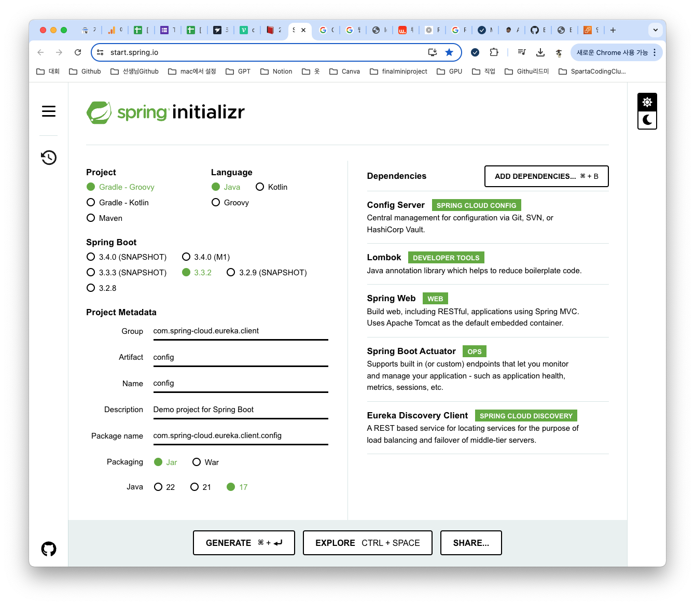
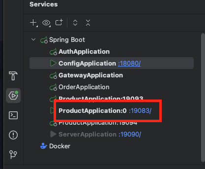
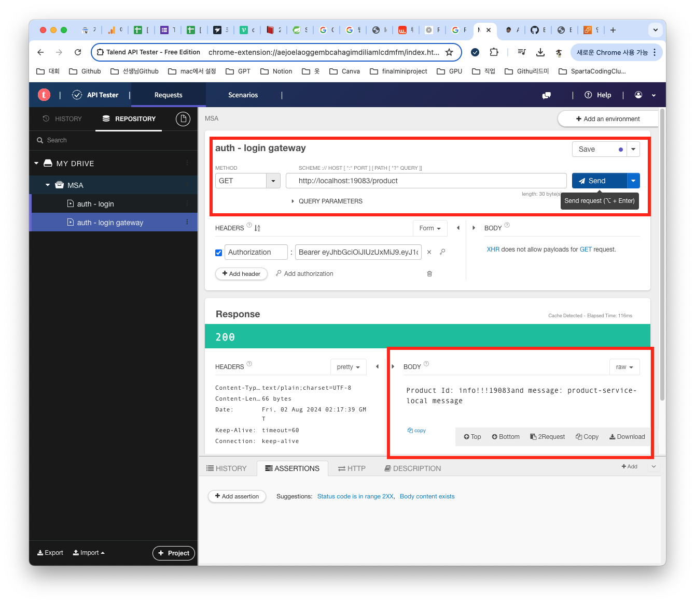
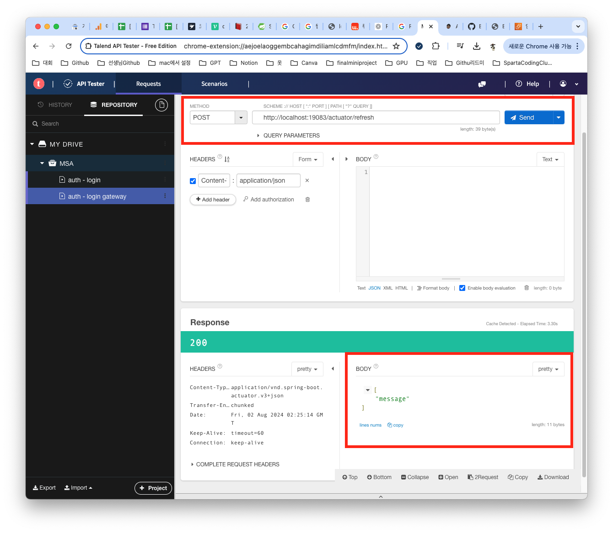
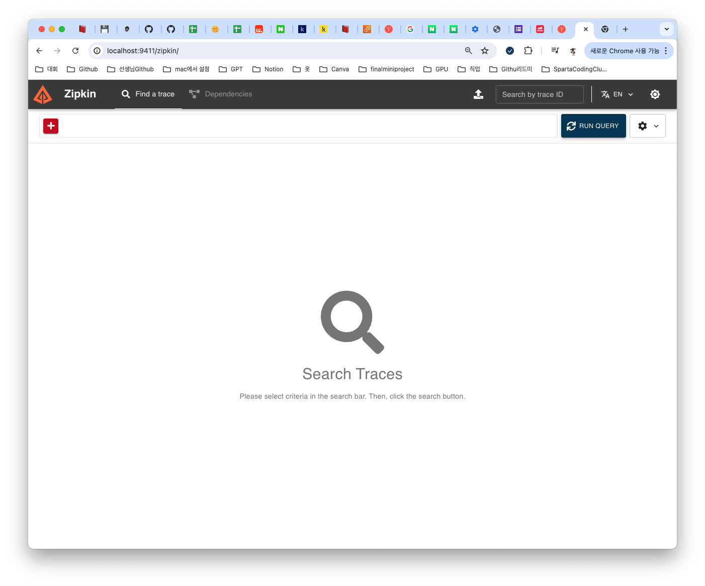
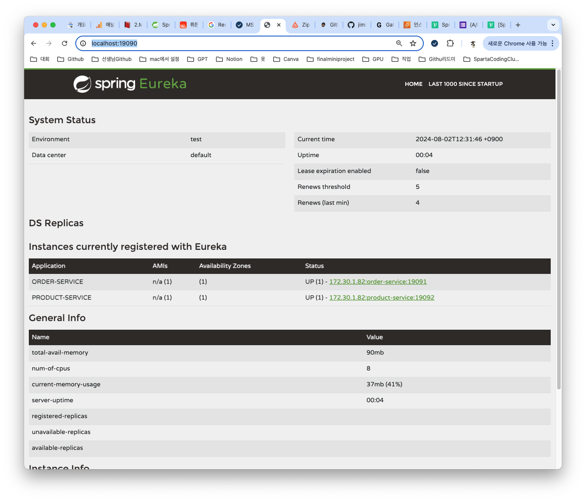
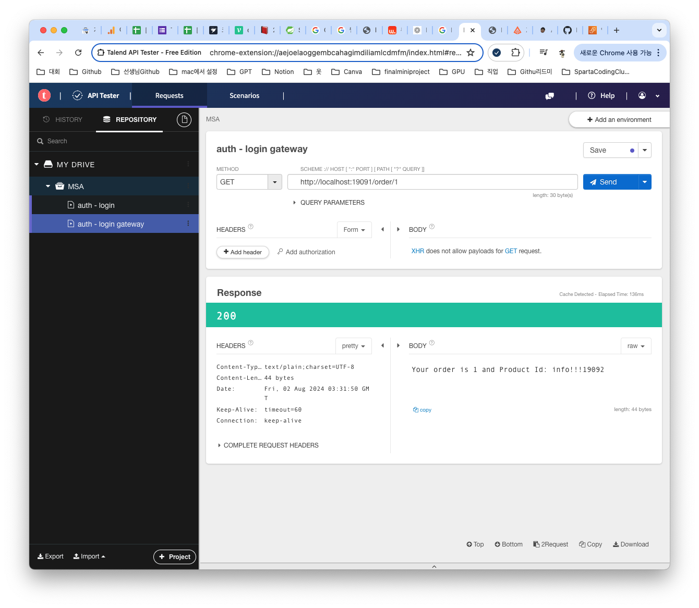
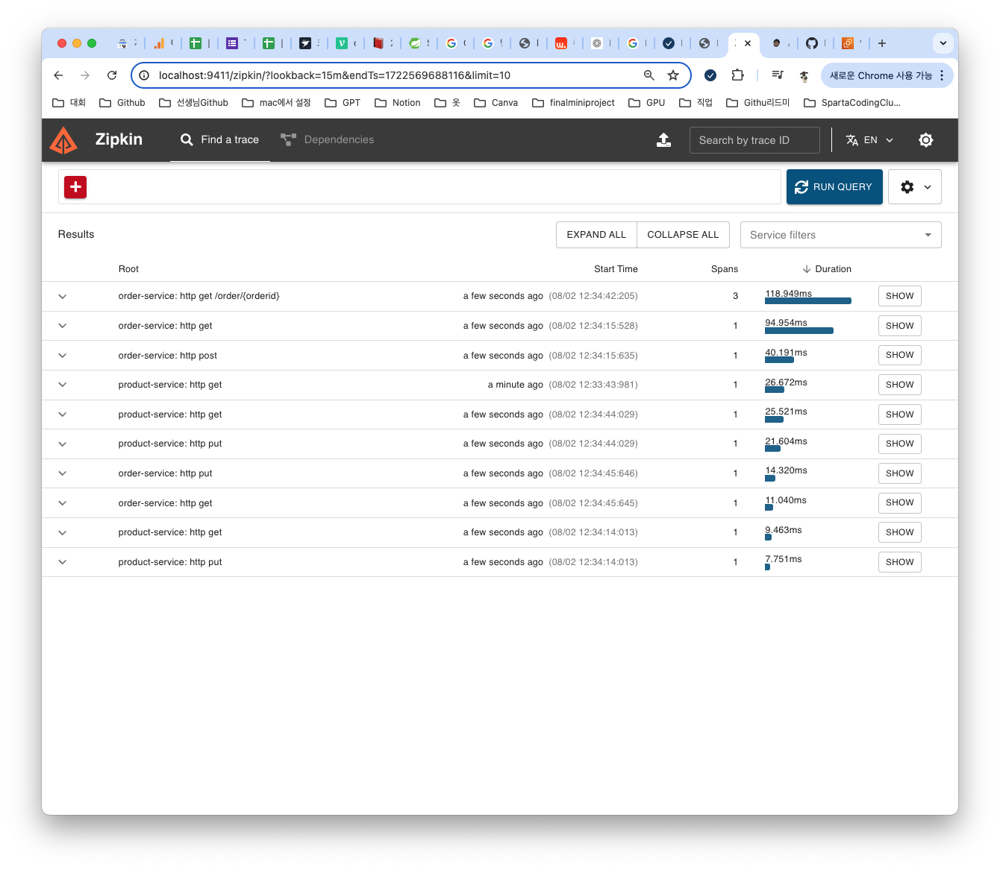

## 🙌🏻 오늘의 코드카타
오늘의 코드 카타 문제는 ***문자열 나누기*** 이다.
* 문제 링크 [프로그래머스 - Level1 - 문자열 나누기](https://school.programmers.co.kr/learn/courses/30/lessons/140108?language=java)

* 처음 나온 문자 -> X 이 X와 다른 문자들의 갯수가 같아지면 끝어주는 것이다.

* 문제풀이
```
public class Solution {
    public int solution(String s) {
        char[] lst = s.toCharArray(); // 문자열을 문자 배열로 변환
        int count = 0; // 현재 개수
        int answer = 0; // 결과
        char check = '\0'; // 이전 문자 초기화

        for (char i : lst) {
            if (count == 0 || check == i) {
                check = i; // 현재 문자를 체크
                count++; // 개수 증가
            } else {
                count--; // 개수 감소
                if (count == 0) {
                    answer++; // 쌍이 완성되면 결과 증가
                }
            }
        }

        if (count > 0) {
            answer++; // 남은 쌍이 있을 경우 결과 증가
        }
        
        return answer; // 결과 반환
    }
}
```
## 🎒 오늘의 강의
오늘은 MSA강의를 끝까지 듣는게 오늘 목표이다. 이제 총 4강만 수강하면 된다. 오늘 보니 새로운 강의가 올라오긴 했지만 현재도 커리큘럼보다는 빠른 편이고 하나 배울때 조금이라고 제대로 공부하는게 좋을거 같아서 주말동안에는 오늘 배운거 복습을 해볼까 한다.

### Spring Cloud Config
#### Spring Cloud Config란?
> Spring Cloud Config는 분산 시스템 환경에서 중앙 집중식 구성 관리를 제공하는 프레임워크이다. 애플리케이션의 설정을 중앙에서 관리하고, 변경 사항을 실시간으로 반영할 수 있고, Git, 파일 시스템, JDBC 등 다양한 저장소를 지원한다. 주요 기능으로는 중앙 집중식 구성 관리와 환경별 구성, 실시간 구성 변경이 있다.

##### 왜 사용할까??
MSA아키텍처를 여러개의 서버를 가지고 있게 된다. 사용하고자 하는 시스템의 환경설정값이 자주 바뀌는 경우도 있을 수도 있다. 그때마다 서버 어플리케이션의 변경된 환경 설정 값을 갱신하여 다시 빌드 배포를 진행해야하는데 문제가 생길 수도 있고 매우 귀찮고 까다로운 일이 되기 때문이다. 그래서 보안적인 측면이나 서버운영 측면에서 보면 서버의 환경설정 정보는 중앙에서 관리를 하고 각 서버 어플리케이션에서 관리를 해주는것이 좋기 때문이다.
#### 작동방식
실시간 구성 변경을 반영하는 방법은 여러가지가 있다. spring cloudBus를 사용하는 방법, 수동으로 /actuator/refresh 엔드포인트를 호출하는 방법, Spring Boot DevTools를 사용하는 방법, 그리고 Git 저장소를 사용하는 방법이 있다. 각 방법은 상황에 따라 선택하여 사용할 수 있다. 그 중에서 오늘 나는 수동으로 /actuator/refresh 엔드포인트를 호출하는 방법으로 실습을 해보겠다.
1. config 서버를 생성하고  product 애플리케이션이 local 에서 동작할 때 포트 정보 및 메시지를 컨피그 서버에서 가져온다.
2. config 서버의 메시지를 변경하여 product 애플리케이션의 message가 갱신되는 모습을 확인 할 수 있다.
#### 실습하기
* [Config] 생성하기

* [Config] application.yml 파일 추가
```
server:
  port: 18080

spring:
  profiles:
    active: native
  application:
    name: config-server
  cloud:
    config:
      server:
        native:
          search-locations: classpath:/config-repo  # 리소스 폴더의 디렉토리 경로

eureka:
  client:
    service-url:
      defaultZone: http://localhost:19090/eureka/
```
* [Config] ~/resources/config-repo 폴더 생성하기
* [Config] ~/config-repo/product-service.yml 생성하기
```
server:
  port: 19093

message: "prodcut-service message"
```
* [Config] ~/config-repo/product-service-local.yml 생성하기
```
server:
  port: 19093

message : "product-service-local message"
```
* [Config] ConfigApplication에 @EnableConfigServer 어노테이션 달기
```
package com.spring_cloud.eureka.client.config;

import org.springframework.boot.SpringApplication;
import org.springframework.boot.autoconfigure.SpringBootApplication;
import org.springframework.cloud.config.server.EnableConfigServer;

@EnableConfigServer
@SpringBootApplication
public class ConfigApplication {

	public static void main(String[] args) {
		SpringApplication.run(ConfigApplication.class, args);
	}
}
```
* [Product] Config Dependency 추가 및 다시 빌드하기
```
implementation 'org.springframework.cloud:spring-cloud-starter-config'
```
* [Product] application.yml 파일 수정
```
server:
  port: 0  # 임시 포트, 이후 Config 서버 설정으로 덮어씌움
spring:
  profiles:
    active: local
  application:
    name: product-service
  config:
    import: "configserver:"
  cloud:
    config:
      discovery:
        enabled: true
        service-id: config-server
eureka:
  client:
    service-url:
      defaultZone: http://localhost:19090/eureka/
message: "default message"
```
* [Product] ProductController 파일 수정 및 추가
  * 추가
  ```
  @Value("${message}")
  private String message;
  ```
  * 수정
  ```
  @GetMapping("/product")
  public String getProduct() {
      return "Product Id: info!!!" + port + "and message: " + message;
  }
  ```
* 실행해보기 실행 순서는 [Eureka-Server] > [Config] > [Product]
##### Talend API Tester로 test 하기
* 현재 [Product] application.yml를 보면 [Config] prodcut-service-local.yml에 연결 되어있는걸 확인할 수 있다.
```
spring:
  profiles:
    active: local
  application:
    name: product-service
```
* [Config] prodcut-service-local.yml의 포트는 19083이고, [Product]에서는 임시포트 0을 사용했다 실행 후 포트결과는 어떻게 될까? 강의를 들으면서 예측을 해보자면 19083으로 떠야 할것이다.

* 그렇다 잘 작동된걸 확인할 수 있다.
* 그러면 http://localhost:19083/product로 날려서 [Config] prodcut-service-local.yml에 적어 놨던 message가 출력되는 지 확인해 보자

* [Product] application.yml에서 profiles.active: local 이 부분을 지우게 되면 [Config] prodcut-service.yml에 있는 Port번호로 실행 되고 message가 출력이 된다.

이번엔 refresh를 추가해서 [Config] prodcut-service-local.yml에 메세지를 수정하고 [Config]를 재실행 하면 적용이 되는지 확인 해보자
* [Product] actuator Dependency 추가하기
```
implementation 'org.springframework.boot:spring-boot-starter-actuator'
```
* [Product] application.yml에 코드 추가하기
```
management:
  endpoints:
    web:
      exposure:
        include: refresh
```
* [Product] ProductController에 @RefreshScope 추가하기
```
@RefreshScope
@RestController
public class ProductController {
  .....
}
```
* [Config] prodcut-service-local.yml message에 "update!!!"문구 추가하기
##### Talend API Tester로 test 하기
* [Config] 재실행 하기
* POST http://localhost:19083/actuator/refresh로 refresh 됬는지 확인하기

* GET http://localhost:19083/product message 확인하기


### 분산추적
#### 분산추적란?
> 분산 추적은 분산 시스템에서 서비스 간의 요청 흐름을 추적하고 모니터링하는 방법이다. 각 서비스의 호출 관계와 성능을 시각화하여 문제를 진단하고 해결할 수 있도록 돕는다.

##### 왜 필요할까??
MSA에서는 여러 서비스가 협력하여 하나의 요청을 처리한다. 서비스 간의 복잡한 호출 관계로 인해 문제 발생 시 원인을 파악하기 어려울 수 있다. 그래서 분산 추적을 통해 각 서비스의 호출 흐름을 명확히 파악하고, 성능 병목이나 오류를 빠르게 진단할 수 있다.

#### 작동방식
나는 Zipkin을 통해서 분산추적 실습을 진행할거다. docker로 Zipkin을 띄우로 대시보드를 이용하여 확인해보는 실습을 진행하겠다. product와 order 서버의 Dependency와 application.yml 파일에 추가를 한뒤 Talend API tester로 요청을 보낸뒤 Zipkin 대시보드에서 확인 해보겠다.

#### 실습하기
* 전에 로드밸런싱을 실습했던 파일을 이용할 것이다.
* [Product] build.gradle에 아래 Dependency로 수정
```
dependencies {
	implementation 'org.springframework.boot:spring-boot-starter-actuator'
	implementation 'io.micrometer:micrometer-tracing-bridge-brave'
	implementation 'io.github.openfeign:feign-micrometer'
	implementation 'io.zipkin.reporter2:zipkin-reporter-brave'

	implementation 'org.springframework.boot:spring-boot-starter-web'
	implementation 'org.springframework.cloud:spring-cloud-starter-netflix-eureka-client'
	implementation 'org.springframework.cloud:spring-cloud-starter-openfeign'
	compileOnly 'org.projectlombok:lombok'
	annotationProcessor 'org.projectlombok:lombok'
	providedRuntime 'org.springframework.boot:spring-boot-starter-tomcat'
	testImplementation 'org.springframework.boot:spring-boot-starter-test'
	testRuntimeOnly 'org.junit.platform:junit-platform-launcher'
}
```
##### 💡 Issue 
* 위에 Dependency로 빌드를 하게 되면 아래 오류가 뜬다.
```
Build file '/Users/jimincheol/spartacodingclub_stduy/com.spring-cloud.eureka.client.product/build.gradle' line: 40

A problem occurred evaluating root project 'product'.

Could not find method providedRuntime() for arguments [org.springframework.boot:spring-boot-starter-tomcat] on object of type org.gradle.api.internal.artifacts.dsl.dependencies.DefaultDependencyHandler.

Try:
Run with --stacktrace option to get the stack trace.
Run with --info or --debug option to get more log output.
Run with --scan to get full insights.
Get more help at
```
오류를 확인해보니 providedRuntime 매서드가 인식이 되지 않아서 발생했다. 좀더 찾아보니 providedRuntime는 이전 Gradle 버전에서 사용하던 구문이다 현재 나는 3.3.2이고 강의에서는 3.3.1이다.해결방법으로는 providedRuntime -> compileOnly로 수정해서 빌드하면 된다.

* [Product] application.yml 파일 추가
```
management:
  zipkin:
    tracing:
      endpoint: "http://localhost:9411/api/v2/spans"
  tracing:
    sampling:
      probability: 1.0
```
* [Order] build.gradle에 아래 Dependency로 수정
```
dependencies {
	implementation 'org.springframework.boot:spring-boot-starter-actuator'
	implementation 'io.micrometer:micrometer-tracing-bridge-brave'
	implementation 'io.github.openfeign:feign-micrometer'
	implementation 'io.zipkin.reporter2:zipkin-reporter-brave'

	implementation 'org.springframework.boot:spring-boot-starter-web'
	implementation 'org.springframework.cloud:spring-cloud-starter-netflix-eureka-client'
	implementation 'org.springframework.cloud:spring-cloud-starter-openfeign'
	compileOnly 'org.projectlombok:lombok'
	annotationProcessor 'org.projectlombok:lombok'
	providedRuntime 'org.springframework.boot:spring-boot-starter-tomcat'
	testImplementation 'org.springframework.boot:spring-boot-starter-test'
	testRuntimeOnly 'org.junit.platform:junit-platform-launcher'
}
```
* [Order] application.yml 파일 추가
```
management:
  zipkin:
    tracing:
      endpoint: "http://localhost:9411/api/v2/spans"
  tracing:
    sampling:
      probability: 1.0
```
* Docker로 Zipkin 실행
```
docker run -d -p 9411:9411 openzipkin/zipkin
```

* [Eureka-Server] > [Order],[Product] 순서로 실행
* [Eureka-Server]에 등록 확인

* Talend API Tester http://localhost:19091/order/1 요청하기

* 다시 http://localhost:9411/zipkin/로 와서 Run Query 클릭

* Order-service가 Product-service를 호출하는 과정이 트래킹 되는 것을 확인 할 수 있다.
#### 후기
zipkin을 사용하면 어디서 요청시간이 오래걸리는지 확인 할 수 있고 어디서 어디로 호출이 되는 지 과정을 확인 할 수 있어서 매우 좋은것 같았다.
## ✍🏻 오늘 공부를 마치며
오늘 MSA강의를 모두 다 들었다. 3일동안 강의 시간의 비례해서 나눠서 계획했고 그 계획을 잘 따라서 일정에 맞춰서 강의를 수강 했던거 같다. 블로그 정리는 마지막 두 강의에 대해서는 오늘 알바가 있어서 정리 못한점은 아쉬우나 주말을 이용해서 정리를 해야겠다. 강의를 한번 수강 했다고 해서 완전히 내꺼가 된다는 생각은 없다. 반복해서 들어야 하고 반복해서 실습을 해봐야한다. 그리고 지금 강의는 작동 원리에 대해서만 실습을 진행했다. 실제로 프로젝트에 적용할려면 어떤 어려움이 있을거고 첫 설계에 대한 어려움도 있을 것같다. 잘 복습해서 나중에 잘 적용을 해봐야겠다.