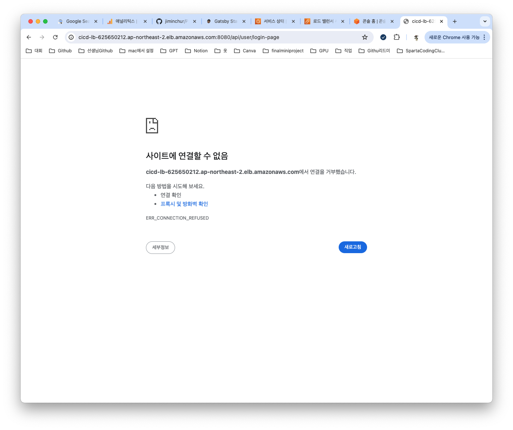

## 🧐 2주차 회고록
과제를 최종적으로 마무리를 하였다. 하는 도중엔 별 무리가 없었던거 같다. 이 중에 시간을 제일 많이 투자 했던 부분은 Header에 서버 포트를 담는 것이였다. 여러가지 방법을 찾아 적용을 해봤는데 지금 현재 적용했던건 밑에 챕터에서 설명을 해보겠다. 구현에서 말고 Github에 푸시를 할때 엄청 큰일이 생겼었다..무려 6시간이나 투자를 했지만 원하는대로는 커밋을 못하고 어찌어찌해서 파일들을 푸시하고 다시 클론해서 확인을 해봤을땐 문제가 없이 잘 작동을 하였다. 근데 내가 설정해놓은 부분이 다 날라가 버려서 피드백 해주시는 튜터님이 조금 고생하실거 같아 미안하다...

CICD부분은 배포까지 완료를 했으나 DNS로 접근 할려고 하면 접근이 안된다.

어제 깃허브 커밋 이슈로 시간을 다써버려서 정확한 원인을 아직 찾지는 못해서 내일 시간을 내서 한번 원인 분석을 해보고 다시시도를 해봐야 할거 같다.

## 📘 Chapter 1. 과제 제출 레퍼지토리
[👉🏻 Project_Chapter-1-MSA-Project 링크](https://github.com/jiminchur/Project_Chapter-1-MSA-Project)
* 과제에 대한 내용이나 실습사진들을 Github Readme에 적어 놓았으니 참고 바란다.

## 🤟🏻 Today I Learned 
오늘은 모든 API의 Response Header에 Server-Port Key로 현재 실행중인 서버의 포트를 추가하는 부분에 대해 알아보자.

[👉🏻 모든 API 의 Response Header 에 Server-Port Key로 현재 실행중인 서버의 포트를 추가하기 링크](https://github.com/jiminchur/Project_Chapter-1-MSA-Project)
