## 🙌🏻 오늘의 코드카타
오늘의 코드 카타 문제는 ***모음사전*** 이다.
* 문제 링크 [프로그래머스 - Level2 - 모음사전](https://school.programmers.co.kr/learn/courses/30/lessons/84512?language=java)

* 문제를 풀기전에 설계를 하자면 가능한 모든 문자 조합을 구한뒤 정렬을 해서 해당 word가 들어오면 인덱스 값의 1을 더해서 리턴을 해주는 것이다.

* 제한사항
  * word의 길이는 1 이상 5 이하입니다.
  * word는 알파벳 대문자 'A', 'E', 'I', 'O', 'U'로만 이루어져 있습니다.

* 문제풀이
```
import java.util.ArrayList;
import java.util.Collections;
import java.util.List;

public class Solution {
    public int solution(String word) {
        List<String> words = new ArrayList<>();

        for (int i = 1; i <= 5; i++) {
            generateWords("", i, words);
        }

        Collections.sort(words);

        return words.indexOf(word) + 1;
    }

    private void generateWords(String current, int length, List<String> words) {
        if (length == 0) {
            words.add(current);
            return;
        }
        char[] chars = {'A', 'E', 'I', 'O', 'U'};

        for (char c : chars) {
            generateWords(current + c, length - 1, words);
        }
    }
}
```
* words를 변수로 빈 리스트 생성
* i 가 1부터 5까지 도는 for문 생성
* generateWords 매서드 생성
  * 받는 건 현재 단어, length라고 말했지만 쉽게말해 위에 for문에 있는 i이다. 그리고 리스트 words
  * 중간의 if문 length가 0이되면 words의 추가
  * chars는 모음들 모아둠
  * 마지막 for문은 예시를 들어가면서 설명하겠다.

#### generateWords 매서드 예시
1. i == 1 일때 ("",1,[])
* length = 1이므로 if문 통과
* for문으로 다시 generateWords 매서드에 ("A",0,[]),("E",0,[]),("I",0,[]),...순으로 들어가게됨
* 이후에 if문에서 걸려서 words의 들어감
2. i == 2 일때 ("",2,['A', 'E', 'I', 'O', 'U'])
* length = 2이므로 if문 통과
* for문으로 다시 generateWords 매서드에 ("A",1,[]),("E",1,[]),("I",1,[]),...순으로 들어가게됨
* length = 1이므로 if문 통과
* for문으로 다시 generateWords 매서드에 ("AA",1,[]),("AE",1,[]),("AI",1,[]),...순으로 들어가게됨
...

* 이 순서를 반복하면서 모든 경우의 수가 words안에 들어오게된다.
* return words.indexOf(word) + 1;로 모든 경우의 수가 있는 words에서 word의 인덱스 값을 +1를 해주고 리턴을 하게 되면 된다.

## 🎒 오늘의 강의 
오늘은 MSA강의를 처음 시작하는 날이다 총 12개의 강의가 있는데 나는 4개씩 듣고 3일동안 끝낼려고 한다. 커리큘럼상 MSA는 5일 이지만 3일 안에 끝낼려고 하는 이유는 강의 난이도상 밀릴수도 있고 빠르게 끝내면 다른 공부를 할수가 있을거 같아서 그랬다.

### MSA란 무엇일까?
MSA라고 구글에 검색하면 제일 먼저 나오는게 다음과 같다.
> MSA는 소프트웨어 시스템을 여러 작은 독립적인 서비스로 분할하여 개발하고 배포하는 방식입니다. 하나의 애플리케이션을 구분 가능한 여러 개의 작은 서비스로 나눠 사용자의 요청을 처리하는 구조이죠.

MSA는 Microservices Architecture의 줄임말로 하나의 애플리케이션을 여러개의 독립적인 서비스로 분리하여 개발,배포,유지보수를 용이하게 하는 소프트웨어 아키텍처 스타일이다. API를 통해서만 상호작용을 할 수가 있고 서비스의 End-Point(접근점)을 API형태로 외부에 노출하고, 실질적인 세부 사항은 모두 추상화한다.그리고 서비스간 통신은 주로 HTTP/HTTPS, 메시지 큐등르 통해 이루어진다.

### MSA vs 모놀리틱 아키텍처
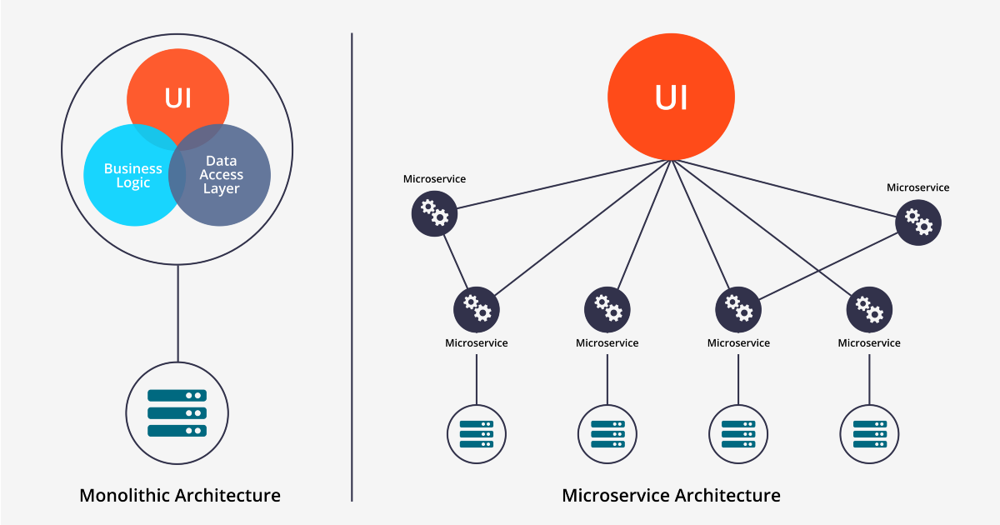
#### 모놀리틱 아키텍처
* 모놀리틱 아키텍처는 하나의 큰 코드베이스로 구성된 애플리케이션이다. 즉, 모든 기능이 하나의 애플리케이션 내에 포함된다.
* 회원,상품,주문뿐만 아니라 여러개의 비즈니스 로직이 추가된다면 코드베이스가 커지게 되는 구조이다.

* 장점
  * 간단한 배포와 단일 데이터베이스이다. 하나의 코드베이스에 포함되어 있어 배포가 단순하고 하나의 데이터베이스를 사용하여 데이터 일관성을 유지할 수 있다.
  * 초기 개발에 유리하며 빠르게 프로토 타입을 개발할 수 있다.

* 단점
  * 단점은 사이즈가 커질 수록 나타난다.
  * 특정 기능을 확장하렴면 전체 애플리케이션을 확장해야하고 작은 변경사항도 전체 애플리케이션을 다시 배포해야한다.
  * 부분 장애가 전체 서비스의 장애로 확대될 수 있다. 
  * 전체 시스템 구조 파악이 어렵다.

#### MSA
* 장점
  * 특정 서비스만 확장하여 성능을 최적화 할 수 있고 개별 서비스의 변경 사항을 독립적으로 배포할 수 있다.
  * 새로운 기술을 적용하기 유연하다. 특정 서비스만 별도의 기술 또는 언어로 구현이 가능하다.
  * 각각의 서비스에 대한 구조 파악 및 분석이 모놀리식 구조에 비해 쉽다.
  * 서비스별 작은 팀으로 구성하여 민첩한 개발이 가능하다.
* 단점
  * 서비스 간 통신, 데이터 일관성 유지, 트랙잭션 관리등 복잡성이 증가하게 되고, 각각의 서비스마다 모니터링 로깅 장애 대응등 개별적으로 관리해야 하므로 운영비용이 증가한다.
  * 설계의 어려움이 있다. 서비스가 모두 분산되어 있기 때문에 개발자는 내부 시스템 통신을 어떻게 가져가야 할지 정해야 한다.
  * 통합 테스트가 어렵다.

MSA의 장점은 모놀리틱의 단점을 많이 커버하는 부분들이 많다. 그렇지만 개발초기 단계나 소규모 개발에서는 MSA방식보다는 모놀리틱이 더 어울리는 거 같다.

### Spring Cloud
> 스프링 클라우드는 스프링 프레임워크 기반의 클라우드 네이티브 애플리케이션을 개발하기 위한 프로젝트입니다. 분산 시스템에서 필요한 다양한 기능들을 추상화하여 제공하고 있고 MSA를 구현할 떄 유용하게 사용된다.
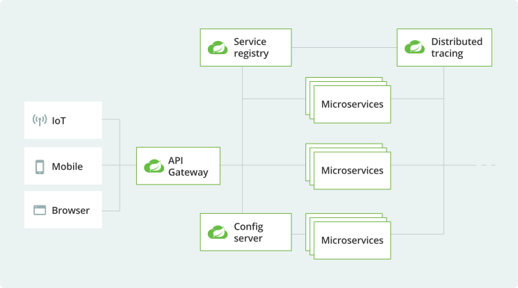

주요 기능은 다음과 같습니다.
- **서비스 등록 및 디스커버리**: **Eureka**, Consul, Zookeeper
- **로드 밸런싱**: **Ribbon**, Spring Cloud LoadBalancer
- **서킷 브레이커**: **Hystrix**, Resilience4j
- **API 게이트웨이**: Zuul, Spring Cloud Gateway
- **구성 관리**: Spring Cloud Config
- **분산 추적**: Spring Cloud Sleuth, Zipkin
- **메시징**: Spring Cloud Stream

주요 기능들을 그림과 함께 살펴 보시죠

#### 서비스 등록 및 디스커버리
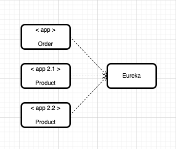
* Eureka
  - 넷플릭스가 개발한 서비스 디스커버리 서버로, 마이크로서비스 아키텍처에서 각 서비스의 위치를 동적으로 관리한다.
  - 모든 서비스 인스턴스의 위치를 저장하는 중앙 저장소이다.
  - 서비스 인스턴스의 상태를 주기적으로 확인하여 가용성을 보장한다.

#### 로드 밸런싱
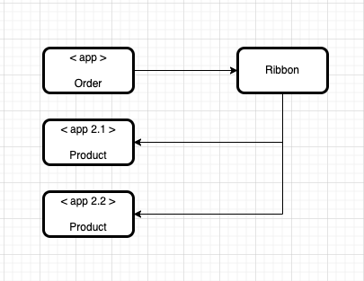
* Ribbon
  - 넷플릭스가 개발한 클라이언트 사이드 로드 밸런서로, 서비스 인스턴스 간의 부하를 분산한다.
  - Eureka로부터 서비스 인스턴스 리스트를 제공받아 로드 밸런싱에 사용한다.
  - 라운드 로빈, 가중치 기반 등 다양한 로드 밸런싱 알고리즘 지원한다.
  - 요청 실패 시 다른 인스턴스로 자동 전환한다.

#### 서킷 브레이커
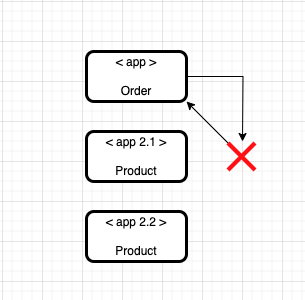
* Resilience4j
  - Resilience4j는 자바 기반의 경량 서킷 브레이커 라이브러리로, 넷플릭스 Hystrix의 대안으로 개발
  - 호출 실패를 감지하고 서킷을 열어 추가적인 호출을 차단하여 시스템의 부하를 줄인다.
  - 호출 실패 시 대체 로직을 실행하여 시스템의 안정성을 유지한다.
  - 호출의 응답 시간을 설정하여 느린 서비스 호출에 대응할 수 있다.
  - 재시도 기능을 지원하여 일시적인 네트워크 문제 등에 대응할 수 있다.

#### API Gateway
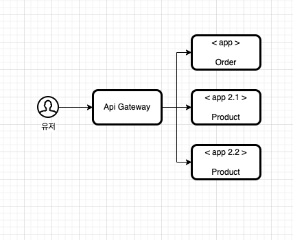
- Zuul
    - 넷플릭스가 개발한 API 게이트웨이로, 모든 서비스 요청을 중앙에서 관리한다.
    - 요청 URL에 따라 적절한 서비스로 요청 전달한다.
    - 요청 전후에 다양한 작업을 수행할 수 있는 필터 체인 제공한다.
    - 요청 로그 및 메트릭을 통해 서비스 상태 모니터링 할 수 있다.

#### 구성관리
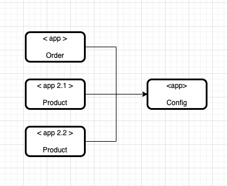
- Spring Cloud Config
  - Spring Cloud Config는 분산된 환경에서 중앙 집중식 설정 관리를 제공한다.
  - 중앙에서 설정 파일을 관리하고 각 서비스에 제공한다.
  - Config 서버에서 설정을 받아서 사용하는 서비스이다.
  - 설정 변경 시 서비스 재시작 없이 실시간으로 반영한다.
  - .yml 파일들을 이곳에 한꺼번에 저장한다.

apigateway나 로드벨런싱에 관해서는 여러번 공부한적이 있어 익숙하지만 나머지 부분에 대해서는 들어보긴 했으나 기능들을 자세하게 본건 처음이였다. 

### Eureka 실습하기
> Eureka를 이용해서 서비스 등록하는 실습을 해보겠다.
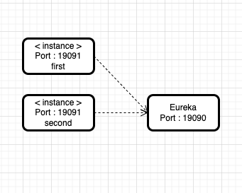
Eureka Server 하나와 같은 기능을 하는 instance을 2개를 연결해 보겠습니다.

#### spring initializr로 eureka sever , instance first , instance second 생성하기
[Start.spring.io 링크](https://start.spring.io/)
강의와 동일하게 진행하기 위해서 spring initializr으로 파일을 생성해서 진행 했다.
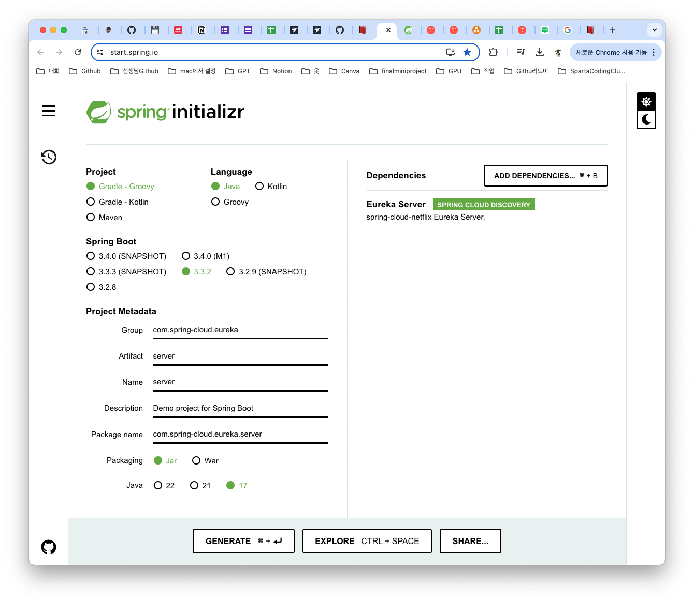
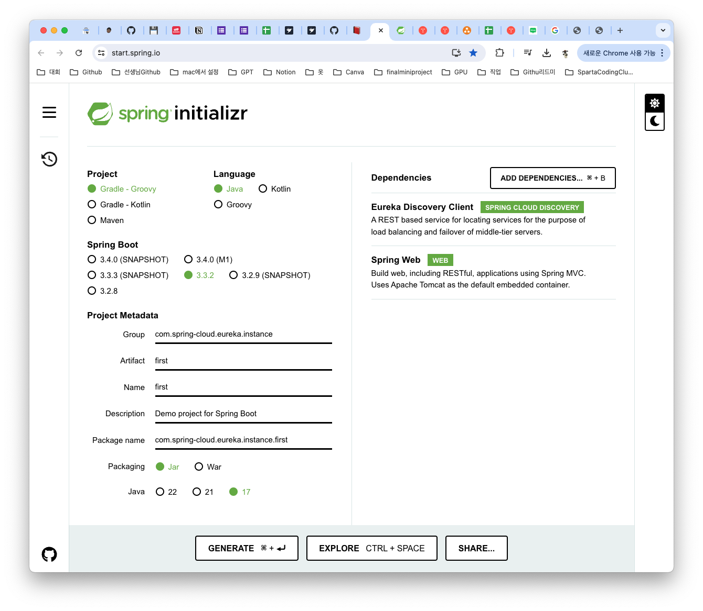
* Second도 Name부분만 second로 수정해서 진행 하면 된다.

우선, Eureka Server쪽 부터 작업하겠다.
1. ServerApplication.java로 가서 어노테이션 등록하기
```
import org.springframework.boot.SpringApplication;
import org.springframework.boot.autoconfigure.SpringBootApplication;
import org.springframework.cloud.netflix.eureka.server.EnableEurekaServer;

@EnableEurekaServer
@SpringBootApplication
public class ServerApplication {

	public static void main(String[] args) {
		SpringApplication.run(ServerApplication.class, args);
	}

}
```
2. application.properties파일
```
spring.application.name=server

server.port=19090

eureka.client.register-with-eureka=false

eureka.client.fetch-registry=false

eureka.instance.hostname=localhost

eureka.client.service-url.defaultZone=http://localhost:19090/eureka/
```
* server.port=19090
  * server port 설정하기
* eureka.client.register-with-eureka=false
  * 기본값은 True
  * Eureka 서버에 자신을 등록할 것인가??
  * 해당 서버는 Eureka 서버이므로 false
* eureka.client.fetch-registry=false
  * 기본값은 True
  * 유레카 클라이언트가 유레카 서버로부터 다른 서비스 인스턴스 목록을 가져올거냐??
  * 해당 서버는 Eureka 서버이므로 false
* eureka.instance.hostname=localhost
  * 유레카 서버 인스턴스의 호스트 이름을 설정
  * 자신의 호스트 이름을 다른 서비스에 알릴 때 사용
* eureka.client.service-url.defaultZone=http://localhost:19090/eureka/
  * 유레카 클라이언트가 유레카 서버와 통신하기 위해 사용할 기본 서비스 URL을 설정

first,second 서버의 appliction.properties 수정하기
```
spring.application.name=first

server.port=19091

eureka.client.service-url.defaultZone=http://localhost:19090/eureka/
```
* second는 19092를 사용한다.

#### 실행하기
실행 순서는 Eureka Server > first,second 이고 실행 후 http://localhost:19090/eureka/에 접속해서 잘 연결됬는지 확인한다.
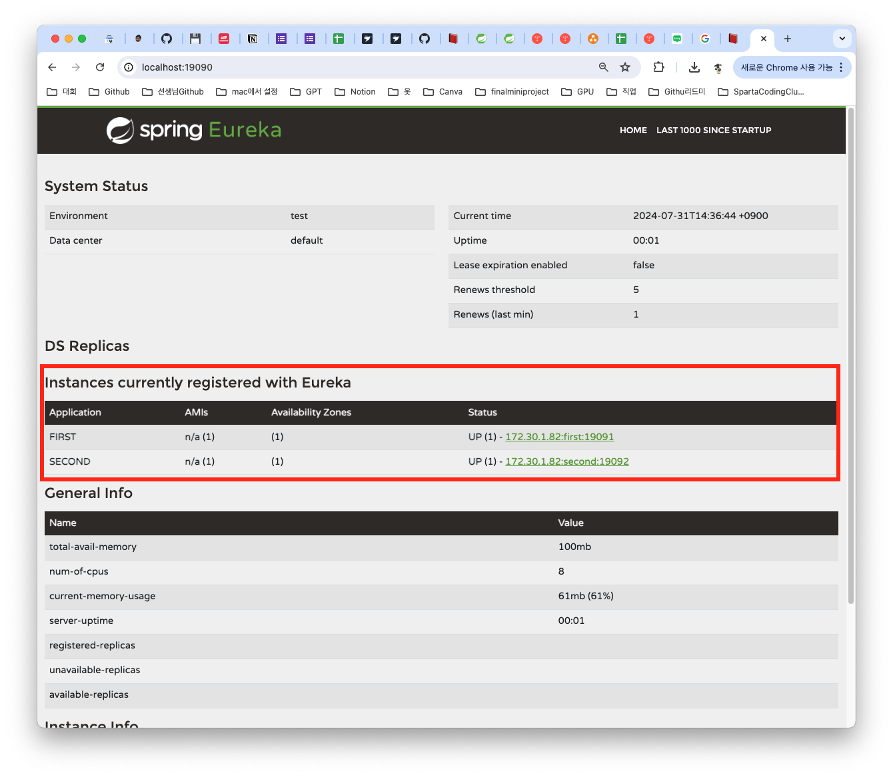

### 로드밸런싱 실습하기
> FeignClient로 실습 진행하였다.
* 주문은 주문아이디가 1인 주문만 있다고 가정
* 1 주문은 2번 상품을 호출한다고 가정
##### Eureka server는 그대로 진행 새로운 서버 oreder와 product 생성하기
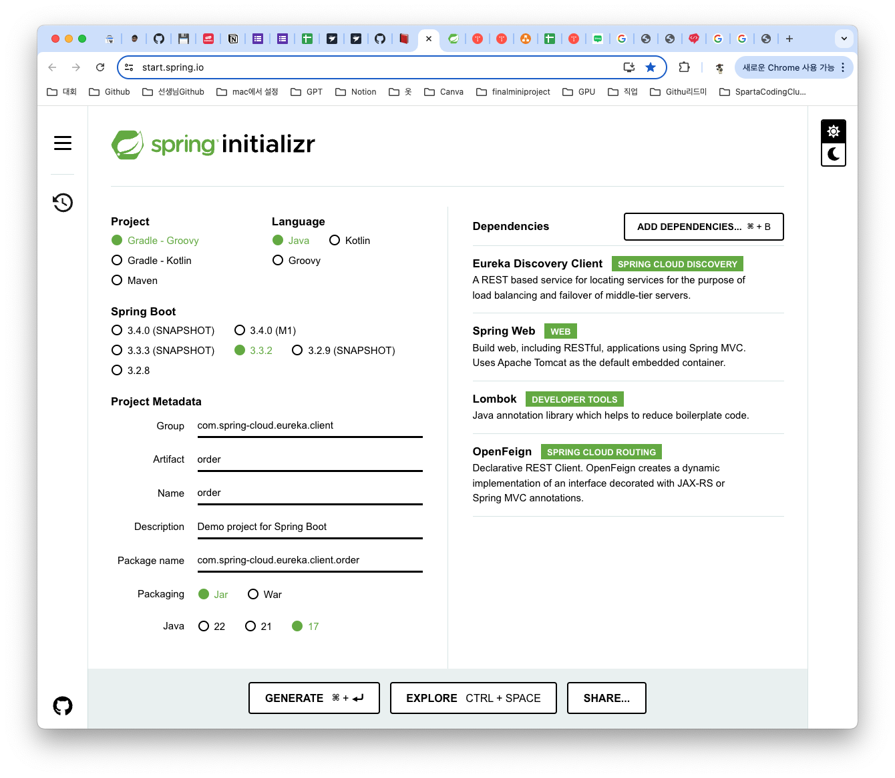
product도 이름만 바꿔서 생성하면 된다.
##### product 파일 수정
* productapplication 어노테이션 추가
  * @EnableFeignClients
```
import org.springframework.boot.SpringApplication;
import org.springframework.boot.autoconfigure.SpringBootApplication;
import org.springframework.cloud.openfeign.EnableFeignClients;

@SpringBootApplication
@EnableFeignClients
public class ProductApplication {

  public static void main(String[] args) {
    SpringApplication.run(ProductApplication.class, args);
  }

}
```
* productcontroller 생성
```
import org.springframework.beans.factory.annotation.Value;
import org.springframework.web.bind.annotation.GetMapping;
import org.springframework.web.bind.annotation.PathVariable;
import org.springframework.web.bind.annotation.RestController;

@RestController
public class ProductController {

    @Value("${server.port}") // 애플리케이션이 실행 중인 포트를 주입받습니다.
    private String serverPort;

    @GetMapping("/product/{id}")
    public String getProduct(@PathVariable String id) {
        return "Product " + id + " info!!!!! From port : " + serverPort ;
    }

    
}
```
* application.properties 파일 삭제 .yml파일로 생성 및 코드 작성
```
spring:
application:
  name: product-service
server:
  port: 19092
eureka:
  client:
    service-url:
      defaultZone: http://localhost:19090/eureka/
```
##### product 19092,19093,19094로 3개 생성하기
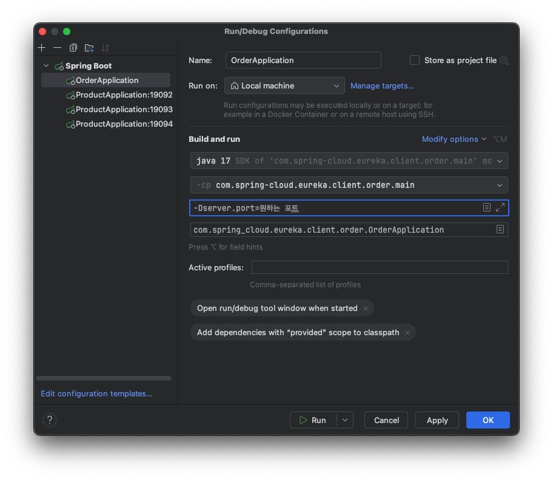
1. Edit Configuration에 접속하면 위에 사진처럼 창이 뜬다.
2. ProductApplication 클릭 후 왼쪽 위에 플러스 버튼 눌러서 복제하기
3. 포트 변경하는 법은 Modify options에서 add VM options 클릭
4. Build and run에 생긴 빈칸에다 그림과 같이 `-D=server.port=원하는 포트` 를 입력해주면 된다.

##### order 파일 수정
* product와 같이 OrderApplication에 어노테이션 달기
* OrderController 생성
```
import org.springframework.web.bind.annotation.RestController;

import lombok.RequiredArgsConstructor;
import org.springframework.web.bind.annotation.GetMapping;
import org.springframework.web.bind.annotation.PathVariable;


@RestController
@RequiredArgsConstructor
public class OrderController {
    
    private final OrderService orderService;

    @GetMapping("/order/{orderId}")
    public String getOrder(@PathVariable String orderId) {
        return orderService.getOrder(orderId);
    }
    
}
```
* productclient 인터페이스로 생성
```
import org.springframework.cloud.openfeign.FeignClient;
import org.springframework.web.bind.annotation.GetMapping;
import org.springframework.web.bind.annotation.PathVariable;

@FeignClient(name = "product-service")
public interface ProductClient {
    @GetMapping("/product/{id}")
    String getProduct(@PathVariable("id") String id);
}
```
* orderservice 생성
```
import org.springframework.stereotype.Service;

import lombok.RequiredArgsConstructor;

@Service
@RequiredArgsConstructor
public class OrderService {

  private final ProductClient productClient;

  public String getProductInfo(String productId) {
      return productClient.getProduct(productId);
  }

  public String getOrder(String orderId) {
      if(orderId.equals("1") ){
          String productId = "2";
          String productInfo = getProductInfo(productId);
          return "Your order is " + orderId + " and " + productInfo;

      }
      return "Not exist order...";
      }
  }
```
* application.properties 파일 삭제 .yml파일로 생성 및 코드 작성
```
spring:
application:
  name: order-service
server:
  port: 19091
eureka:
  client:
    service-url:
      defaultZone: http://localhost:19090/eureka/

```
* 유레카 서버 → order → product(3개 모두) 순으로 실행
* http://localhost:19090/ 으로 접속하면 인스턴스를 확인
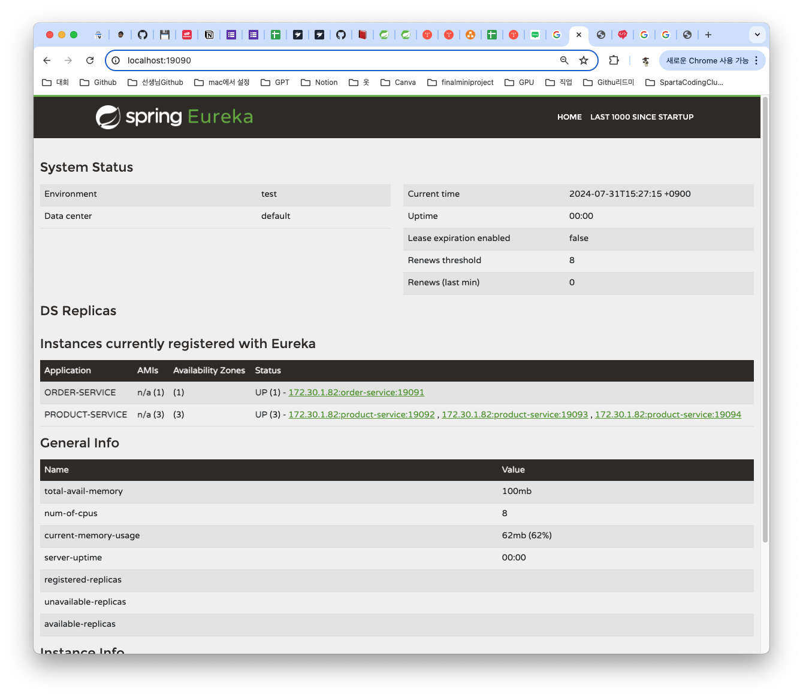
* http://localhost:19091/order/1 에 접속할때마다 텍스트의 포트가 변경되는것을 볼 수 있음 이를통해 요청마다 라운드로빈으로 동작함을 확인할 수 있음

최종 작동 방식을 내가 이해한 부분에 맞춰서 글로 써보자면
1. http://localhost:19091/order/1에 접속하면
2. OrderController에서 1만 받아서 
3. OrderService로 넘어감
4. if문을 만족해서 productId를 2로 getProductInfo 통해 ProductClient로 넘어감
5. Product쪽으로 http://localhost:19092/product/2,http://localhost:19093/product/2,http://localhost:19094/product/2 로 넘어가서 port번호를 얻어 다시 역순으로 돌아가 "Your order is " + orderId + " and " + productInfo; OrderService에 return형식으로 Controller를 통해 web에 띄워짐 
6. 만약 orderId가 1이 아니라면 "Not exist order..."로 띄워짐

### ✍🏻 오늘 공부를 마치며
Eureka와 로드밸런싱을 배우면서 MSA를 공부해가는 게 재밌었다. 오늘 처음에 모놀리식과 MSA를 비교하는 부분이 있었는데 비교를 해보면서 MSA의 강점이 정말 많다라고 느꼈다. 하지만 소규모 프로젝트나 개인프로젝트를 할때 과연 MSA방식을 채택하고 사용한 이유나 이 부분에 대해서 잘 설명 할 수 있을까라는 생각이 들었다. 지금은 공부하면서 경험한다고하지만 이 이후에 프로젝트를 진행할때 어떤 방식을 선택할지는 앞으로 공부하면서 더 생각을 해봐야겠다. Eureka에 대해서는 많이 재밌었다. 처음에 MSA에 대해서 들었을때 궁금했던 부분이 여러개의 서버를 통신을 할까 였는데 이부분을 공부하면서 궁금증이 해소 되는거 같았다. 로드 밸런싱에 대한 부분은 이미 알고 있는 부분이여서 새롭지는 않았지만 진행했던 방식은 새로워서 재밌었다.